# P27：Talks - Dan Craig_ Testing Spacecraft with Pytest - VikingDen7 - BV1114y1o7c5

 Can you hear me？ Oh， great。 All of the room， I can take it after any questions， or the time talk。 And it creates a game called， Create a News Work Game Institute， and an Internet Development。

 which is the area that just sort of， quite as hard as news is。 Okay。 if you can take it in around the file， can you welcome me？ I think for the one that I've got in。

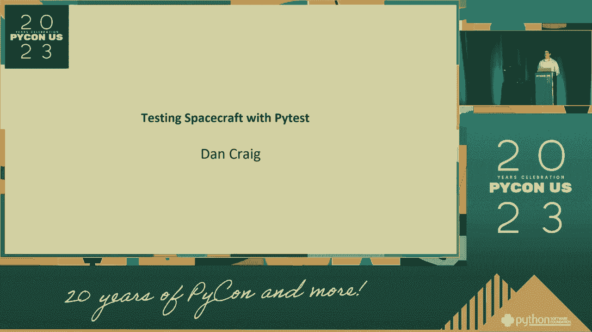

 the Federal Budget of New York， my name is Dan K。

 I'm a， 14-year-old， that provides the new power to， post communication and guidance。 What are the schedules I'll also use to do？ I'll add a top-to-line right。

 and it'll stay on the road for a month or more。 It'll perform a pharmaceutical。 maybe a top-to-line operation。 And they'll capture a little separate， and close the address。

 letting you know that you're doing music。 Obviously， we're doing our best。 for the decision of successful one。 We're able to listen to software， too。

 and involve a lot of software testing。 We're fortunate to have， a much tremendous act of tools。 available for us to make this possible。 Well， a pipeline and a type test， that could be one of them。

 which could be one of them。 I'll talk about that later in the talk。 But it's important to us to remind， that a lot of the discourse that。

 are on software testing over the last 20 years， has been dominated by web services。 And web services are great， but we need to consider， the different decisions to variety。

 and to make it more sustainable。 And we're not seeing very many things。 in the way that the systems can be， well-developed。 It's just a fantastic thing to find。

 Both tend to be remote from the museum， or web server， or a computer center， or in the cloud。 They're fast about the bus。 Both tend to work on a request-to-point。

 and a test-to-post-to-send stream-to-seam-to-seam-to-seam。 Not unlike a modern， well-informed。 but a website。 Well， the differences， though， is that the system feels network-like to the new one of them。

 First-class really only have， a consistent network connection， when it's over a bounce-based。 depending on your orbit， but it might only be a few times a bit。

 You also generally have no physical access， to your post-class， depending on your team's post-class。 like a satellite。 So there's nobody you can go in， and just to re-state about。

 And you're still really in a test。 And lastly， the impact that a few or a class。 or a few of you think can have， on your post-class is very different。

 from what you can have on your website。 And I also think about this。 as a kind of line of how to share， about the volume and credit quality。

 The volume has been the number of requests， for operations that your software is performing。 And。 depending on your credit quality， any one of those requests for operations。

 have an experience because of the detail。 And most web services operate down here on the bottom。 There's five volume and low credit quality。 So here's an example of， supposedly， the eight-plan。

 which is something that you might have thousands of millions， of users making millions of requests。 to your ACI。 And if you're busy surviving the production， it starts to cost you money。

 It's a thing that might be a vulnerability， to your ACI。 And if you're busy surviving the production， it starts to cost you money。

 It might be a vulnerability to your ACI。 Maybe they don't get to make the cost here。 Two doesn't regret it。 But it's not really an individual。 And because you're in such a high volume。

 most of you may not even know that， the bug ever happened。 And this process has all the opposite sides of your credit。

 So it's low volume and high credit value。 And I only have one state price， that you're working with。 And if you're performing one operation， like a rocket launched for a recent。

 after a game of reentry sequence， you're only going to do that one thing。 And it's not to work。 but during one time that it came。

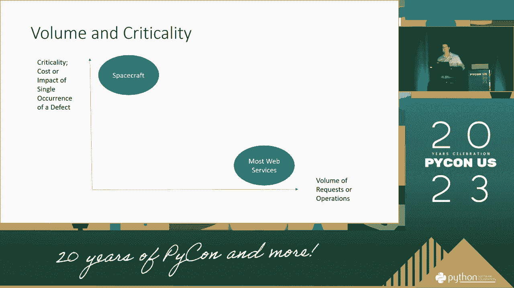

 otherwise， there were votes to be prevented。 For a decade。 In fact， before 1996。 the main line was already filed。 Roger， from seven-second venture chart， this happened。 [silence]。

 So， what happened to it？ So the iron-5 bar-watch from the iron-4， it's pretty expensive。 Including this generation measurement unit。 And the iron-use software was a。

 little fast alignment routine that could be used， to be a quick recycle of a lot。 and get an ask for an abort。 Iron-5 didn't need this capability。

 The infrastructure software was left in the fourth。 And it compared common-oriented regions。 and the thousand-year blood test unit， and that's why it had an agent on iron-4。

 In this alignment routine was a tight conversion。 Of a horizontal bias value from a 464 to a diamond to 2。 And the iron-4， by a value， was solved。 And the larger it got to iron-5。

 it was bigger than the original side of the strategy。 And the software had to design conservative regions， so that iron units sat down。

 and then they had an agent on a very important section， which was to do it。 And even the rockets saw it in blood。 Not knowing what's going on， but knowing what's going on。

 it was quite an agent that was built out over there， and then in which one was stored apart。 And then you might wonder， like， what you're talking about， buying a new onboard。

 what happened now to these two？ Well， there was a bad guy buying a new iron-in-board。 but it was running the same software， it was running the same exhibit。

 and it felt that it had exactly the same effect。 So what do we like in this？ Well。 this is a bigger cost， because it's a big hole in our software。

 because it's very different from hardware。 It's a big hole in our software。 because it's very different from hardware。 It wasn't a random area of how cars did both。

 became the daily specification。 The software performed in the software that was specified。 The problem was that it was tested exclusively for wrong。 So it would be a whole other talking。

 and several key issues would be provided， by how you could provide your quick-paced precision。 of that product， and not get it into that， too。 Because there's another way to make it。

 that we can take away the software that we could use。 And it's that the operating environment。 that your software is running is just as important， as the code itself， for instance。

 just as for an execution。 Because if your operating environment is different。 from what you tested and analyzed， it might be the relevant one， or misreading。

 and going into a false thing as a confidence， I would be a better than today， and five developers。 And the task of testing is software。 The only environment that it will be used。

 when it actually is running the production。 The example of a tree。 The site that I designed right there， was right there was a line， launched in 2020-2015。

 It was a key to that， and it was designed to be a deployment of a solar field。 and send them by or a sheet， which means that the monitoring of the solar wave。

 was supposed to pull it。 The same thing was right， there was a slide。 And what happened？ Well。 right there was one， and it was 15 seconds， but then there was almost a beacon message。

 And it beautifully logged that message to a stream of C5。 The problem was。 you said nothing was rotating that final， so a drill and a value can pull it up。

 to 32 million dollars of gas coming from a flight computer。 Once that happened。 the state saw what became a response， which was created in a possible community。

 and it was created in a new way， and it was created in a new way， and it was created in a new way。 And it was created in a new way， and it was created in a new way， and it was created in a new way。

 and it was created in a new way， and it was created in a new way， and it was created in a new way。 and it was finally rebooted。 And we were able to reach that one task， and it was very reasonable。

 before it was set back up， and then they could deploy a set。 and ultimately they wanted to have a successful mission。 So what we learned here。

 for why is that software defense， can be a few million over time？ There's no really fast strategy。 so if I hope all of you do， and you can't take this case of wrong and seconds。

 you might never know that， that you just have been a fellow， for the course of this game。 The other lesson we can take here is a positive one。

 which is that how do you know it can deploy a six-year bug。 to make the difference between success and service？ Level number three， far as timeline is。

 level of flight status， it's been a 20， 2019。 So I know it's always made me believe， that an unsure。 of the real state-sized fight， before it's been an increase in the international association。

 While it was on its own， it synchronized the mission of our time cost， which is at least five weeks。 The problem was， it just synchronized it too early。

 The 40-year-old team of the two-year-old team of the two-year-old。 team of the two-year-old team of the two-year-old team， was working at Starliner。

 and that was teaching me to the world， $11 apart on the mission team。 Except for instance。 the first-class fight was in the wrong place， between the later-long time。

 And then now the mission is to see， the five-year-old's best provided by the two-year-old。 by the first place， which came in as a pro-test to realize。

 that they're trying to do the same thing， to do the same thing。 So how do you think？ Well。 it seems to feel like never integrated history， between Starliner and the better。 It's five。

 and very long-term it is。 So what we're going to take away from this。 is that we can just test it in a way， that must test across the tenet places。

 Because these are two reasons， that have different understanding of that tenet min， of tenet places。 And if there's no such thing， that's integrated in a hardware-only system。

 then what matters to you is the question， because the mission is to implement。 a two-minute performance of your system， but you could be tested into the tenet possible。

 and to think。 And if you can't do that， then you need to have over-lapping integrated tests。 And I'm very careful with here， about the existing system A and B and B and B and B。

 and the same test test has to overlap。 Otherwise， you have a gap。 which is not touching your class every minute。 But I'm assuming to take on a new project。

 and there may be many other software， that you can say， "P， and as mentioned。 the legacy is going to be out by cause， of any accident in this kind of design definition。

 that's in your name and test for it。"， So， now， I think we're going to look at， a lot of research。 But in any minute， it's just marketing。 There's a lot of ways that your system might fail。

 And so ultimately， you're asking the question， and it really is the community way that you're asking。 your question。 But this is a suggestion。 And you're about to think about it， as a tradition。

 It's a typically new tradition， or anything you question here。 When you're running in a production environment， as well as this one， as you can see it。

 there are three acceptable answers to this。 No， maybe， and probably。 Yes。 this is not an acceptable answer to this question。 It is not a prediction。

 it is what the plot is called。 Popper would call a faultifiable hypothesis。 Now。 it can be distributed， but it can never really be distributed。 Like。

 you may collect corroborating evidence， that a true task in a test case is law。 We may know that the software doesn't even compile。

 so there's no way it would ever run in production。 But we can never do so how it's going to fall into production， and still retain into production。

 What we're left with is how do you consider that situation？ And hopefully。 we are somewhere along this continuum here， between the middle and the middle。

 It's definitely not going to work， or probably almost certainly， because it's going to work。 I want to know ourselves along that， and gain confidence， to be more corroborating evidence to that。

 and to be more elaborate， and more elaborate， we're feeding evidence that we have。 despite rigorous defense to be。 And more confidence that we have before we release the thing to production。

 So now we have to ask how much profit is going to be really needed， and even my people want it。 Go to a fault confidence。 And probably， if you've got any confidence， cost effort and time。

 then that costs money。 If it doesn't really matter， if you get it wrong。 why would you wait for it to have an effort， trying to make sure that you're running a 99% right。

 for this problem to succeed？ So I also have to be following a question that is a really big question。 to think about how much profit is going to be needed。

 And I'm going to go really avoid the need to be quiet。 I can't ever got it。 I think you can miss me。 but I'll switch to false decisions。 But for these questions， I can ask you to buy a statement。

 You need more confidence， and you need not so much profit。 So we'll start with the benefit。 Can you stop at nowhere， and you just don't want it。 You can't cost profit in there。 If you don't。

 you need more confidence before you're in a situation。 Can I cause large things for a while？

 You know， the benefit of the cause， I think you're a birth certificate。 If so， the need。 more confidence。 How critical is it that it works the very first time in production？

 This is that goes back to the personality volume， as I was talking earlier。 For a rocket。 the first time is in production， and no production load is when it's missing off from the past on the planet。

 And everything else is worth saving。 So you need to work that one and only one time。 For a lot of。 but both services， we can take a lot of steps to reduce the personality。

 and it's going to take a lot of time。 And as in， it's going to take these two to the end of all day。 and it's going to go into the end， growing the climate， and these two sides， and， you know。

 deploying the production before you're in。 These two， all those techniques are really good。 And what they're talking about is reducing the criticalities。

 of that very first time in operation production。 And how close the two are cost environment maximum？

 This is， you know， since you've seen some of those， there's a lot of that。 that costs you five and five and ten。 But it can be really hard for the first time。

 since you're particularly， because we are creating a new vacuum， in microgravity。 in a high radiation environment， and thermal， in a stream。

 And it can continue to come up out on the ground， but it's really hard to get it right。 to get it to be a cost efficient consensus。 And so we need a lot more confidence going into it。

 because we don't know the objective value that we need in that environment。 Up frequently。 we need to stop our running production。 This is on volume side of that side。 You know。

 if you stop our runs with aim operation over and over and over。 you can gain confidence in each one of those operations over time。 But if it only does one time。

 and that one time the rocket is launching， and it's doing the interesting thing about it。 and it makes me vehicle。 But if I get right that one time。

 we need more confidence going into 40 minutes。 But while we need to get it to roll out， as you know。 it's made the difference for the right performance。

 and it's looking at maybe not easy in the web software world， but it's unfortunately not。 And a lot of people do get it， and it's stuck in that vicious cycle。

 where the department first roll and two falls， and doing what's often mean。 a higher confidence before you can deploy it。 But any other time， and it's a cycle on and on and on。

 and when you're developing a space class， it can be very easy to decode and auto-。 and it's really a very important thing to do。 So， what do you mean because then。

 it's also going to be successful？ For most of the fact that our teammates are our management。 or I was going to pick them， but when you're doing what's made difficult。

 it's not going to regulatory over time。 And remember， the regulated job is not to help you。 but it's a question。 The regulated charges to protect the values of public funding。

 and from your potential forward。 And they do it by asking you to follow。 but it was going to end in taxes， and you saw a few of them are accessing。

 the software and the system and the data that will be stored。 And so。 they needed to be able to see that you did what you said， and were going to do。

 and that involves leaving an audit there， and leaving the editors behind every testing。 that you knew you were announcing。 So， how do we avoid our mistakes。

 so that's why it's taking on confidence。 So， we define them。 we define a follow-up like "Wait-Class" for us to see。

 so we have two sets of eyes that are in change， three， which is a higher-techy。 We put our input systems on hardware and the root testing， so all of our rights are up here。

 But we do have unit tests， and they're just useful for our technical and developmental， confidence。 So， it's really really， really， so we can't throw that in the way of， in a clear， in a clear。

 in a clear country。 So， we're out of full screen of hardware and root tests， regularly。 and we're probably as much as possible， because the voice-playing in the effort。

 is trying to justify not running the test， because it's an increase in the report。 We do have regular focus， so we have our long-term history， it's to cover well beyond this。

 to find a way to reach things with power， up to satellite。 or we would be able to perform a software like this。 And we have a boss here。

 never doing anything for the first time on the vehicle。 always do it in one of our tech and readiness functions。 So， what would a。

 how do we get to a butterfly in the request environment， for our vision？ So， a mission before this。 I had touched， like， "This guy can sit to tell key pieces， there's the potential in the butt。

 and so here we're going to divide a hardware， and a hardware and a test field for a test field。 and we start here looking at the actual assembly。 And so， there's very， very many in this space。

 and just seeing the test field on the butt。 There's the data for the community。 and the other two of the community， the test field on the butt。

 and the bus provides power to the test field of pleasure。 The data needs to run。 and it's all in the operation， but it needs to be automated。 Now。

 a better test field is what we call， the "class field control"， and that's just where our main。 like， home is good。 And in that two different separate computers running。

 and a couple of different computers are the nodes， of something that's coming in。 and things are going in。 So， in order to make a difference， both of those computers can be wired up。

 to different peripheral devices， and you can also run new， but from both， you can， you know。 fire the tyros to destroy the person， and you can both run on batteries。

 and on the test field once the cash will suffer， and it's going to burn a bit of damage to the racers。 The training is going to， a hardware and a test bed， and you would take all the components。

 of our console and lay them out on the table。 So， we'd have our controller。 and we'd have our GPS and our new， also wired our phone and table。 So， since the computer and tyros。

 can't afford to ask for tyros， then you can just see electricity and go do their fire。 I'm wondering how to test that， because I think we're about to be there in power in this case。

 And this test server was to share all points， and means some commendable tyros to tyros and switches。 so that's a very， very best and better recovery。 And this is what the simple， just like in practice。

 you see that they wrap down the right， the table is here。 and the picture board is on the front of the table， or the power is in。

 and the controller is below it， and it's behind the gray panel， right。 and it's going to be a good experience。 So， we want to run this regularly， and that means auditing。

 and so， in auto-hills it can be possible， to basically run on it and achieve it in a matter of time。 It looks like a matter of time。 We're going to power up the controller。

 and then the first version is thought， to stop our own impact， thank you。 And we started some of our upper software， like our ground software。

 for so much money and commandment。 And then our experience and test services。 and we started our own specific software， and said， "Hey， man， "so。

 we're going to talk to the software， "our power， our search and control， "and generally， our report。"， Now， this sounds like a good resource for this。 My test is to teach you more than it can write。

 We make the testing uses。 We have more than a different test。 and we make the testing use that I've had to fix it。 Now。

 if you're not familiar with our test features， we're aware of the findings。 that are defined by the test data and test data。 And we define a function。

 and you can run set up steps after a point， where it either returns or it years。 You can return or yield an address， or to be a consumer， or to be a fixed function。

 or to be operated on later。 And if you have a more statement， and you can， you know。 you can also write a few notes， or you can also write a few notes。

 or you can just write for the yield， and the test test runs。 and then after the test days is completed， it comes back and runs with that， after the yield。

 and perform a credit on the test。 And so， there is an example of one of our first few。 This is one of our first few。 So， on a scale of a total， and it's just。

 and it's been a series of decoders， writing， and everything。 It's spread。 and then you have an answer， that other first person has to turn up or turn it， and then afterwards。

 try to make it spread， and where the first person is completed。 And another great part of our test。 is the over-construction order of the test data。 We define it， which we can depend on。

 Other first things， the test data can depend on test data。 So， on other first things。 we set the over-construction order of all of them。

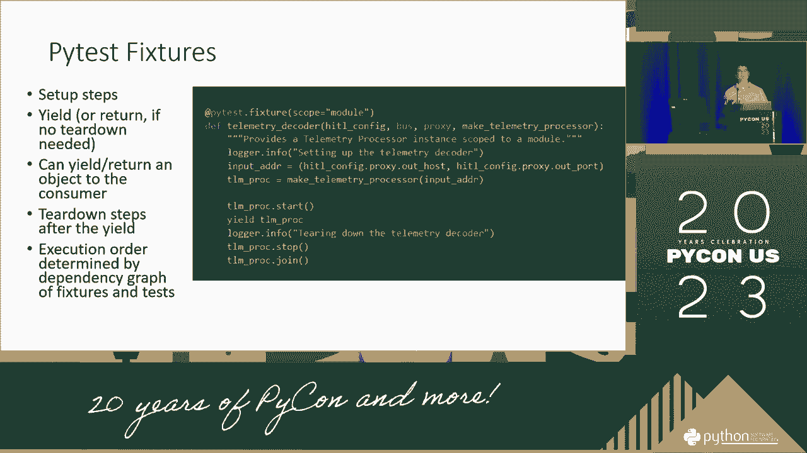

 and it's defined by the dependency graph， of the efficiency of the test。 So。 another aspect of our test data， is that we may be having use of it。 It is a token of our test data。

 You can support me for the thing right now， that I've launched a first person。 and I have a pro bono pipe。 And so， we do that for itself in the control。

 We don't want to do that for every single test test。 We can run things at the module level。 like when we want to switch a configuration， so we can take out the long-body power。

 and run it through the test data in that file。 And you know， at the top level。 if you want to do a one-time test data， then you want to switch this data up。

 and then run it through the parameterized test， with all of these by 360。 And we're quickly multiplying it， and we've got to put in the whole system as well。 And then。

 at the end of the level of our test data。

 we're just going to take the class board， and then we're going to take a couple of new pieces of test。 Why is that we can put in a command line slide， and then take a test slide。

 and just to take a test slide， and call it the notch slide， and then we're going to do it。 And we're going to use this， and we're going to iterate on test。

 and we don't want to spend the time， in three-classing and control。 and everything we're going to take。 And then you'll learn it for all of those， who do this。

 because they're going to be tested， and they're going to call that function。 And this is a node I think is very called。

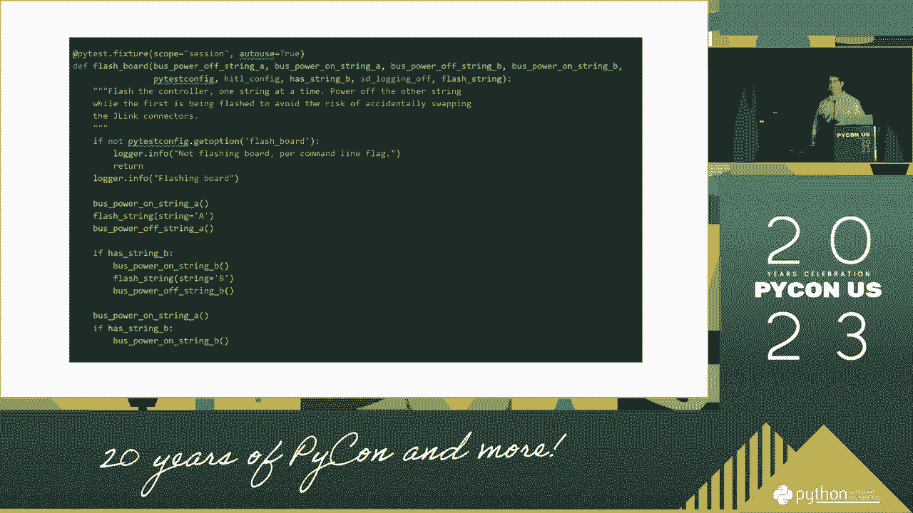

 "saturated" that we make a lot of use of。 Now， "saturated" is when the six-year requirement。 of function， then the power of the dependent， on that six-year command and power， therefore， look。

 And a really nice piece of it， is that when your six-year command， and what it's supposed to do。 so the power of the top， in short， is the power of non-is-training， of the six-year command。

 or the test， or the answer， and so forth。 So， the point is that the switch really is best in。 the action of the two-year command， and it's probably all the connection。

 certainly in here with the power， I don't know。 But the consumer event is to conduct power。 and it causes two power-inspirational conditions。 It doesn't even know。

 it doesn't even know if the power of the command， depends on the number of six-year command。 and it's real， it's just a thing。 It doesn't take any argument。

 It just doesn't know what it's called。 It has a really nice side benefit。

 it's just that you can override， switches in a type of machine， like running on different tests。 So。 the next thing I've seen is that， when we run around the same test case。

 on different tests that have different configurations， we already talked about the test code。 where we have real test code hardware， and we are simulated by some simulator， and it's our。

 and then we can put on power， to the test， so that many researchers， and players decide。 We have different tests， but it's an integrated test code， and a bus， so we're going to say。

 "How do we build a hardware that's available？"， So， both those respond to commands。 that are very different， it's not command of the port and the leader。

 it's a different layer than command of the same request， to power on these tests。 Or。 as no other developer boards， we have it as well， which is kind of like middle-end management。

 it involves a community bus， so we don't have the same component。 command of the power to power on these tests， we just have a little hand-off layer in this case。

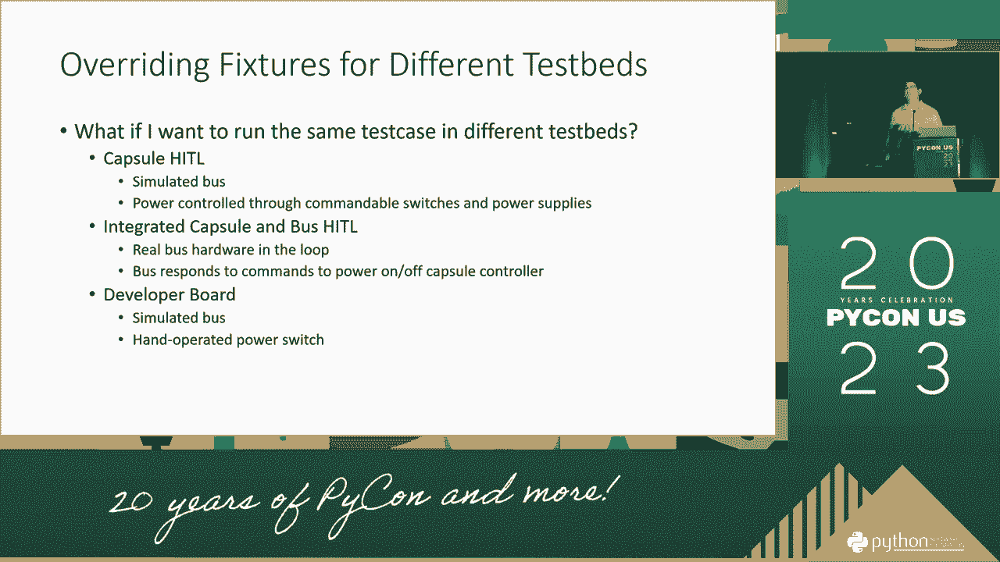

 So， we can implement this by defining， three different folders in our test case。 which is once a whole， once a flat-side， what we call the integrated。

 test-oriented data in this environment， and in a bus file， we can define our test case once。 in one of those folders， and then just import it into the other， and just sort of， and then。

 it was where the logic happened， where we defined that same 60， three different tests。 So。 the one on the top is the six-to-all hardware， and then a test-to-hiddle environment。

 where we wanted to handle a switch， so we can close that real。 And then， all of the time。 we would do it， and then integrate it both side of the environment。

 where we need to send the command into the bus。 And on the bottom， we just call it the user。 which takes 36。 And so， now， it makes a very easy test。

 which has to only test the command in different environments。
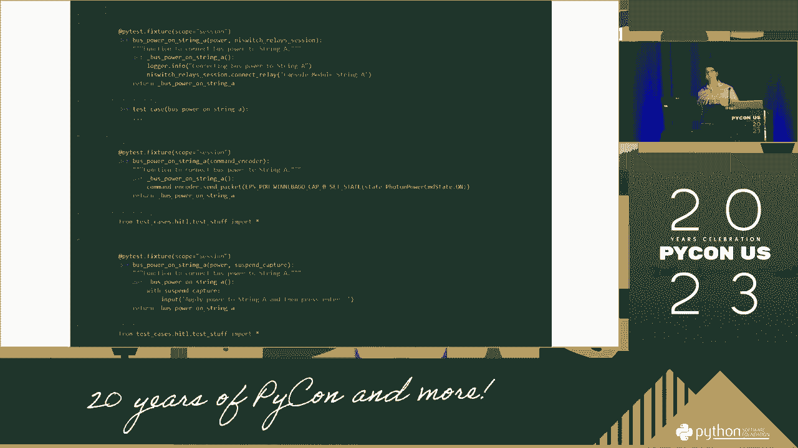

 But， in other cases， in other cases， we need to be prioritizing the test。 And in these cases。 our pilot system has a lot of layers of the dimension。 So， we have two controller nodes。

 and one of them is from different receivers， which are both two-sided and。 both in the same time when it can individually， be initiated on the test。

 And in each of those nodes， it is also looking at a majority vote。 of three different separation cases。 So， there's a lot of combinations of ways， that we could even。

 you know， correct in file or not file to file a particular test。 The solution to this is to parameter those tests。

 because all of this is the command that it's written。 And we do this by， like， these tests do。 where we can have， you know， different tests for running， the full files。

 and just a single string one， or two out of three separate issues。 And we implement that all the multiplication of eight files。

 just having different groups of interest here， to these tests。 And it can really do a good job of decreasing， the word-bought to the inlet of the test。 So。

 sometimes that's not enough。

 Sometimes， we need to make it more easy for these two versions。 And this will work primarily in two-family-to-school。 So， here we have， and this will be。

 a two different consumers on this test， but controller。 And instead。 we look at one of your run-a-lot， the same test on both of those nodes， that we've chosen。 And so。

 does that mean I have to parameterize， my own， you know， and obviously， my test in my test， no。 I can parameterize one system。

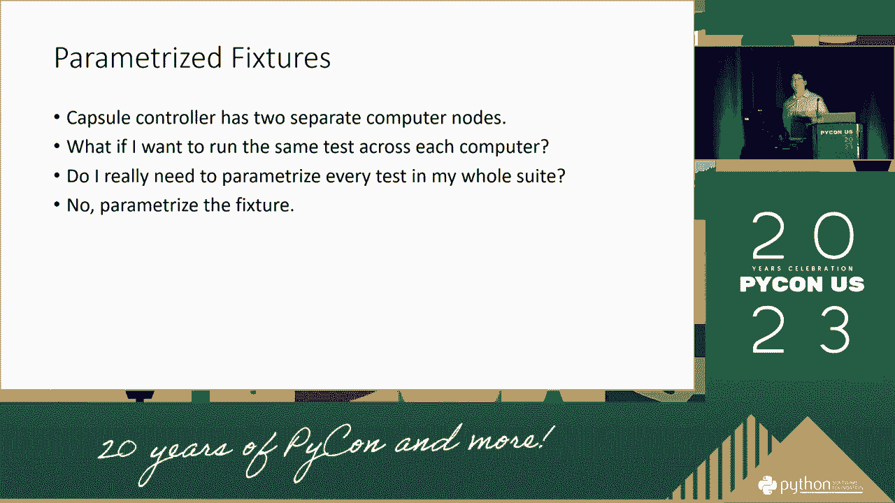

 and have the rest of my test to come on-one。 So， here's the example of this one。 where we have this test meet-back here that runs， and it depends on the node。 And we have a node-1。

 and it has to find out how to test the two-hour， of those tests。 and that's why we have a two different nodes。 And then。

 I've pointed out this is what my test is now， and it doesn't really have to know or care that it's。 actually depending on the time that I touch this。 It doesn't depending on the node。

 and as long as you pass in that three， it's happy。
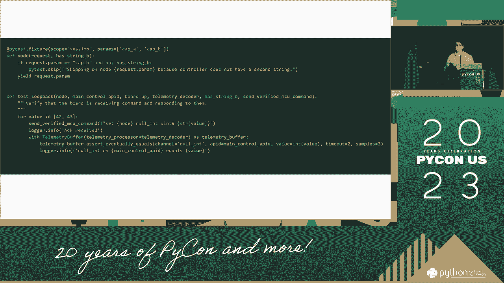

 So， really， I'm just going to try to， so， one time I've taught in a lot of my test， and it's a test。 it's all kind of。 It is， it is from the command and coach in action， and then。

 wait for a little action to take this effect， and be a very， very， very community。 And unlike， say。 an AC， it's just a few requests， but there's no， like， blocking the response that we get。 So。

 we're going to come in， and we just have to wait until the same authority changes。 And we don't want to wait until 50-night of time， and we're kind of like this。

 and this country can't wait to wait until 30 minutes。 So， whenever there's a context measure。 and we call it "quantity" by the way， then there's the context， it's just a simulator。

 and the policy is being collected by a policy teacher， running on a separate path。 And now we can provide a generator， that can yield all this question to a country's function。

 and then， in some points， it's very relevant。 And we can wrap that with the potential to take it down。 just to point to the care of it。 And when we throw the wrap down， we're saying， "Well。

 thanks for taking the help， thanks for taking the help。"， And so， when we're making a good dollar-。
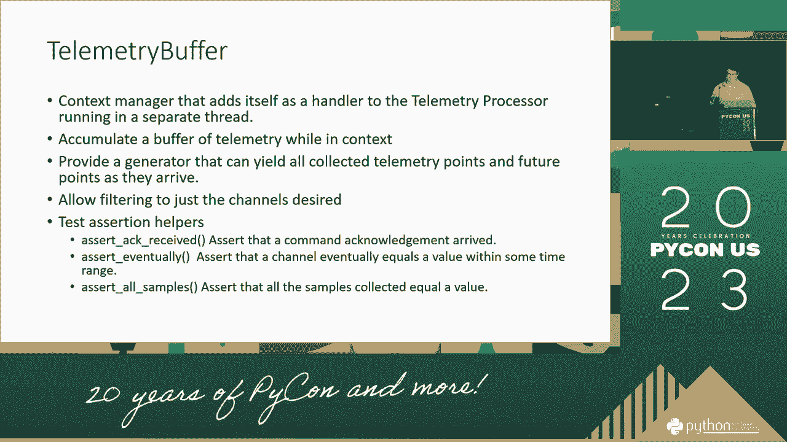

 that's why we're making a good dollar-， that's why we're making a good dollar-。 and then we're going to make a better dollar-， that's why we're going to point to the system。

 We're just going to make a better dollar-， and then we're going to make a better dollar-。 and then we're going to make a better dollar-， and then we're going to make a better dollar-。

 and then we're going to make a better dollar-。

 and then we're going to make a better dollar-， and then we're going to make a better dollar-。 and then we're going to make a better dollar-， and then we're going to make a better dollar-。

 and then we're going to make a better dollar-， and then we're going to make a better dollar-。 and now our first one is called First and First。 We want to take a look at what we're getting at。

 We're going to put the first matching insult， to the matching new values。
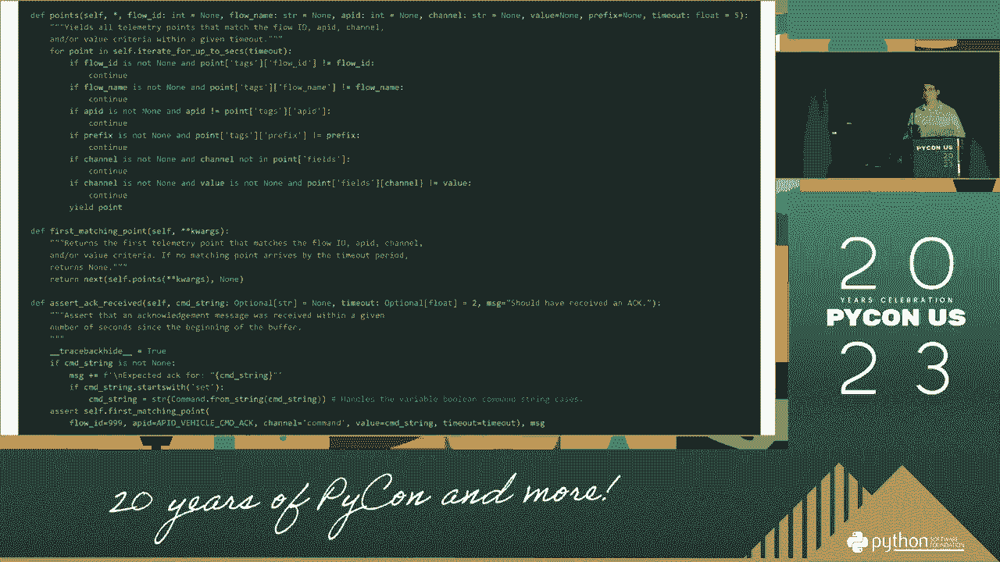

 And first， we're really spending the simple API， for our budget-。 so you can essentially put the values ahead， in the context of the budget-。

 and you can execute your comminence-， and this is our only policy that is going to happen。
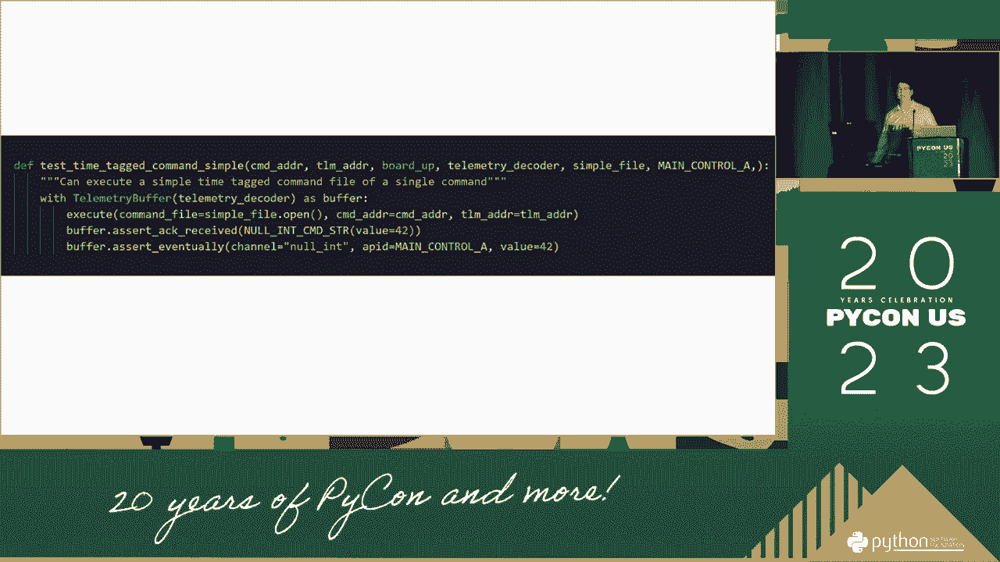

 And instead of some kind of suspension-， for the only citations from now-， to the general report-。 we're going to customize it a little bit with the minutes-， and also the final here-。

 and as you can see， we're going to put the least of our final-， and the final-。 so I guess we're here by setting some annotations， about our fiscal year-。

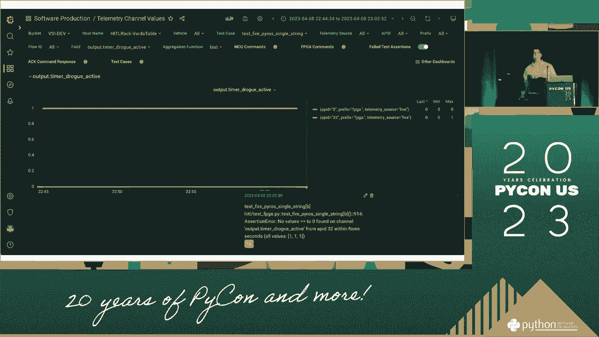

 that is actually going to be the fiscal year-， and this is-， and it is going to be the magic-。 that's put in specifically here-， that it's put in the fiscal year-。

 especially at the introduction-， and it's not the best-， and we've got an inconvenience-。 and then it's gonna get it-， Okay， so this is where our current fiscal year-。

 and we've been using it for about a year-， and been very happy with it-。 we have 20 future improvements-， that we could make it go。 And while I like to say-。

 I use the more-， you know， you're leveraging these annotations more-， and you're saying-。 it's a slightly faster-， and faster-， and faster-， and it's more-， and the attention-， as well-。

 and the-， you know， the very time-， and the social- and-， the time-。 we're going to go ahead and talk about it-， I like to add a log-， to the financial annotations-。

 from log statements-， so that people who are reviewing-， and follow-off-， the consensus-， and-。 I'm looking at the-， as the data reviews-， pictures-， the different areas-， the different-， and-。

 this is for-， not just the survey-， and the specific-， What a UNI folks were saying are。 but for some other health studies as well， as BIMA's to。

 be re-doing it as to getting rid of all of it's site。 So， it was just not too bad there's。 something like that。 It's not specifically a particular report。 I imagine that - in terms。

 of having control of the fifty-year Deputy。 That's it。 I'd love to talk about the code。 coverage that I know I would， possibly will talk about our funding and health。 We're in。

 quite a part of it on our website， which is well written in pipeline that's often what。 we're probably doing for questionation reports。 You can call it a little bit of anything。 You。

 can link to the buyer and directly in the test assets。 And then， possibly as a test。 would have been wrong， it's useful at the wrong number of run。 And so， you know， where's。

 that kind of going？ You know， there's always because we're shorting it or optimizing what， it takes。 And I recently started to tell you a little bit about what types of local。

 policy it can produce in assets， stand by here， but， you know， it's a little bit of。 a time of our test。 And you probably think that we'll be looking at much closer to this， plan。

 And if that lets you go ahead and invite me on the changes。 So， thank you for coming。 I have to。 it's interesting to be。 I'll be around in the hall and see if anybody wants to ask questions and talk more。

 And， for， the talk and the details。

 (eroc herbs buzz)。