# P47：Talks - Łukasz Langa_ Working Around the GIL with asyncio - VikingDen7 - BV1114y1o7c5

 All right。

 Thanks for coming。 Here we are here for the strike-on-clock。 This is not a， I'm sorry。 to present a lesson of training and a schedule， but you're also not allowed to leave now to be there in the fair talk-on-the-fall。

 And just a little bit of the， in the recent， uh， coming-on。

 Before we begin， I've seen a lot of， uh， and again， to the team。 And in legislation。 I've learned that people from the union are too sad。

 And then we can plan on this in person， the vote on those events。 I'm， uh， recently。 I've been in the fight-fall and the new rule。 And now I've been talking about those today。

 And we've got about three or 11 in the recent future。 Uh， I've been to all， I've been on， uh。 really， to be able to work on tight-fronts for time。 Very great thinking about us， because it's。

 you know， the available， for me to do is for another year， so thanks to them。 Uh。 but now I'm not going to be talking about how these things were going to be talking about problems。

 So what is the problem？ Everybody says， "I've got this problem。"， And by then it's， uh。 in different ways， we're only new here in the fight-fall。 And it's going to be really， really。

 really， really， really， really， um， you know， how you observe。 but it's not as efficient as you would like。 We're not going to be talking today about this fight-time。

 we're not going to be talking about the fear of punishing， and number-function power， like， uh。 instead of what we're going to be talking about， it's just， "Can't data engage your skin？"。

 But end up with a terrible data perspective。 So， you know， I think I use many words。 And currently。 when I use words parallel， these stories seem to stain， but they're not， uh， you know。

 I think I use the ability for us to do us in many things， at the same time。 even if we were only able to do one thing at a time。 And currently， then。

 it's actually doing anything for one。 The good analogy for this is that， in a one-bar tender。 and think they're one-bar tender at a time， but they can still look after several questions， right？

 I think we want them to be able to prepare multiple versions at a time， now， in many of them， right？

 So， from currency， you may be able to build multiple controls， and， uh， and then， uh， and then， uh。 and then， uh， and then， uh， and then， uh， and then， uh， and then， uh。

 you may be able to prepare them at the present particular time。 But today。 we're talking about both those rules， so， uh， in particular。

 some of the archetypes of data perspective， and that you're going to see that， uh。 are efficient to get， as you think， with the problem that we're going to be talking about today。

 or data-sink， or data-sink， or either， you know， or， you know。 data that you're accepting from somebody， or the key， or， you know， just a request based。

 where you're mostly just injecting them through a database。 or further analysis later on that is not part of your system， on its own， all right？ So。

 if you're pulling something on their own， or you're doing good data， then you have the red， right？

 And so， the request responds。 Obviously， there's more than， in particular。 just by everybody's sense of its existence。 Well， the request， the response。

 is shared with the total payment， the ability for， to serve in multiple times at the same time。 and give them responses in a sensible time to each of them。 And then， you have lots of use。

 you know， back in my day， to， you know， like， all the way， uh， but now， it's still super useful。 Like， it lets us deal with data that are too big， uh， to be handled by a single thread。

 single problem， or even a single machine。 So， what you do is， uh。 you essentially place the process data， and then combine them with all， right？ So。

 that is essentially the most， um， the interest form of both three， because it doesn't have any， um。 well， this fact is worth， you can focus on， essentially。

 making sure that we can utilize our hardware to its full potential。 So， you know， uh。 let's talk about this kind of process， and it's all typed on， kind of the new ways that are not low。

 and that's the threading。

 It's not going to give you any one of them。 Now， this is， uh。 slides from an internal presentation I did at Facebook， um， seven years， but a year ago now， uh。

 we have， uh， we had seven， you know， three days， where there were two threads， that we were， uh。 working with， and one of them， now， would we expect to be a cooking release， or an illness。

 or a family， but， it's how we draw things， uh， there was a periodic， um， thing that， uh。 a green thread was supposed to go， but for whatever reason。

 it was doing it in a season really rarely， and we were really confused by it because it wasn't that。 the task was taking longer。 Now， it was called the same thing， only。

 but it took an even amount of time for us to wait until it actually happened。 as we really first saw it。 Uh， and it was a little confusing， also， to find out what is happening。

 and believe you know， because if you didn't believe it， nothing was really showing up real。 as you saw， nothing was really， um， obvious where， since people found that in real。

 because if you didn't believe it， or you could only avoid our fields， then you know。 in this long story story， you already found out that， yeah， there was a third one。

 or the third library， a priority used for， uh， performance metrics， where somebody made a statement。 where they were， like， now in some sense， so much data with an effort。

 or any more just for performance metrics， so we're just gonna avoid things in the process。 And because of a flight， we're gonna spend in the house。 I think it was just a swimming data。

 and we never throw in it already， which meant that the third thread was in fact。 facing a long way and a long way to complete。 And why would that even matter for us？

 Why would that matter for the blue and the green thread？ Well。 because the blue wouldn't take a long way。 So I think we have advice on， uh。

 that we had from the day that， I cannot explain it， and we think about it。 there are obvious themes in the story we can improve on it， but it's what we have today， right？

 Even if your computer has multiple processors， or has multiple cores on a single processor。 outside of a few clicks that we can do， only one thread of five-tonal， as it means。

 are within more than any time。 And obviously that seems like a program that could be solved。 so there are multiple attempts to address this。 The first， the previous one that was successful。

 I developed them， and then it's the team， where a lot of these things were removed together。 and I think they're continuing to work。 However， it wasn't really that fast anymore。

 because ironically， having won a rock， or the entire interpretive to protect its data structures。 where it would be efficient， but if the removal of one rock， and then it could be with the new rock。

 it's no longer that fast。 Moreover， the latter was at the time， I mean。 both the naked works in a way where， if we are the core， your program scales up kind of like nearly。

 If you would expect this， right？ If you have a program that is， you know， times with one thread。 it takes more time than one that， you know， you use four threads for it。

 But this is not one of your threads。 So it's pretty tricky， it's paper at all。 and adding more cores and more threads to your program， that didn't do anything actually anymore。

 So this is why the program， you know， is a little bit of a state， and it was kind of not a virtue。 Until some rows from that up came around， and we need to go again， and we need nine。

 And this thing relates to more extent to community。 So it's got， I think， four threads。 It was just lower， and I think we'll thread， because the truth of the matter。

 that's a single rock is faster than any rock， this thing really is hard to， you know。 if it's done through， but it did still。 So if you put four threads on a program。

 it would be 12 to four times faster than just within one， on the same program。 So that's cool。 and there's a type of open， why is it in a tech thread？ Well， because it stands out。

 although I think we'll do a nice work for you。 Depending on， and it's easy to do。 that having a global and local rock grid， there is a lot of， I can't afford， but it's much better。

 because I was never in an issue， even if we're in a tech thread， there are a thick， very wide， so。 you know， it is not an easy decision， for the steering comfort to make。

 whether we should break a thing， or in the name of the ability。 Well， so。 I will read that problem today， and we're gonna talk about the deal。

 and what we can do with having the deal。 So， like， even if we remove it。 and the best place to know it， most of the revenue of Python today is 3。8。 That's right。

 while we are on the drink of 3。8 online， and it's just in the end of the album， the score。 you're gonna need to remove the deal， from 3。13， and it's over 24， that's five years to that。 Well。

 I'm not able to enjoy the deal at Python in 2030， so maybe you'll still stay on the clock。 because it's relevant to what I'm about to say。 Well， so， what are you gonna do today？

 We want to send a particularly， a long time ago， that someone in the heart of， you know。 is our way for Python to wait on an excellent resource， if you need more difficult resources。

 to be available to you。 And why is it hard instead of waiting for one。 and then when it's complete waiting another time for another one， for a new thing around。

 and you say， "I'm interested in all of those， "telling as soon as I'm in this other way。"。 So this is essentially the basis of this thing there。 We have our students who， and in that group。

 you're asking， "Do you have anything for me？"， And you can subscribe to more difficult things that we want。 to do right now， right？ So， I connect things and so on and so on。

 So this is a view of a single request from this point。 but the real matter of the new server that you have， will look more like this， so you have a single。

 you know。
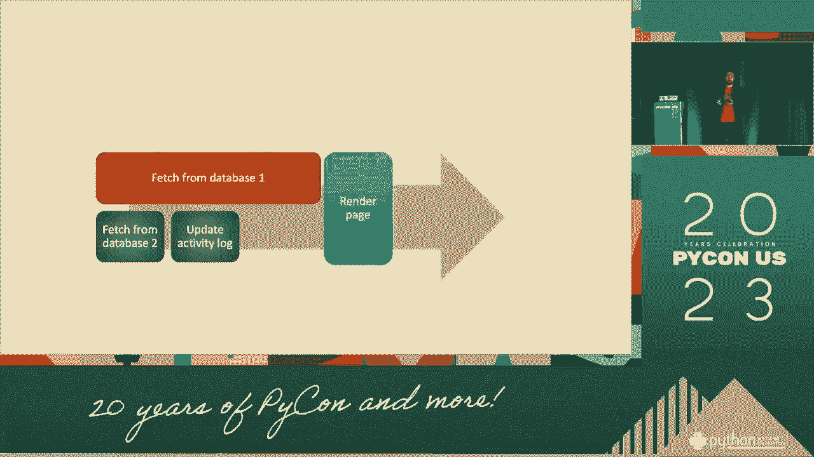

 kind of request in the server， but there's going to be， mainly request for it， you know。 a response to send back at the same time。 And this is the basis of no QIS。

 This is the basis of a Nginx， like， you know， asynchronous programming is very popular in across the board。 It is kind of a great upon that。 It is the most efficient way to do this。

 It's grateful to wait on an app thread， and it's only for， you know， just waiting for it。 So this is what SAPO does。 It essentially allows us to maximize the usage of a single thread。

 If you want to use any threads， just want to multiple processes。 You want to make it before。 This is how we solve it。 And then， in terms of I/O， thank you for making it。

 I also need to subscribe to changes， as they happen when you are notified。 And finally。 you can write a function of Nginx。 You can't， you know， it's working。

 I'm not going to be able to leave you to give you a partner on this。 Today， I'd like to say。 "Acee-Dale" is nice for I/O， but it's also nice for orchestrating。

 or consulting of actual computation。 For example， do I actually order for another？

 So you have only a network in both ways， but it is using a same tool to make it possible for you。 to order form of multiple files in a directory， at the same time。 As long as you have an app for it。

 it will use a same dialog to participate。 So we're going to be talking about how to use it， for。 you know， data science and things。 And on the time to do a partner on this account， so just。

 you know， and there is something that there are， issues in function or those issues in this。 And then， in our own thing， an array or the things that， you know， can be known as I/O。

 So things can happen at the same time， and we're waiting for them。 The nice thing about this is that it leads from top to bottom。 And in example。

 here we're awaiting on a download of file 1， and only after that complete。 we're awaiting the file 2。 You can download and on after that complete。

 we're awaiting for file 3 to download。 So those things are still like we are。 we can read it from top to bottom， you know， and hold back nonsense， no， hold back confusion。

 But we can't do some logic there， and make the house of the isn't very gathered。 We can make those things happen at the same time。 Good luck， thank you。 Well。

 if you would want to know more about this， I actually made like a piece of big。 a little while back that are， like， an in-depth introduction to the isn't there。

 So I encourage you to do so。 I think I know as the framework that allows Python。 to be high-performance enough for production application。 And in fact， as we did yesterday。

 it is written in Python， and it is written using asynchronous and it is high-performance。 So。 back to my thinking。 I was thinking about it in these days。

 We'll just hear with some time series data， so we're going to use some fun data frames。 that are built-in objects in one column， and some numbers in a second column。

 Because despite things out， sometimes the number will be， none， so no fun numbers。 It was something wrong in the middle， in a bad individual。 And so on。 So， because， in fact。

 if you say， "I don't really have a great real-world example for you there，"。 but it will enable us to see all the new data。 So， in this example。

 my mind works best with examples， so we are able to focus on the processing products。 Later on。 you can add on a server on top of those。 You can add more data on top of that。 So。

 there is a focus on the processing data。 The processing data is simple。 So。 you can load some data from somewhere， and we process it， and then you can turn it。 But， obviously。

 the data is bigger than what you can handle， and that's what we've referred。 or maybe even on a single machine。 What you have to do is， you have to switch to the data。 Somehow。

 that is where it works， and only later you turn it。 So， this is what we're going to do。 And at first， we're going to have this example with， you know， going to serialize processing。

 Later on， we're going to split and apply some magic。 and we're going to see that the cooking one is 25 times faster。 So， you know， we'll put it all in。

 Anyway， I will be showing the code， but that's the image all of the pattern， and if you are like me。 you get somebody disrupted by saying， that this unit but you don't like understanding because。

 we are using cultural functions that don't mean， you can set your source。 I like to use one slide。 and you can see that you can see that you have。 The print is not a print。

 because I wanted the print to be nice。

 and I wanted it to be colorful， and I wanted it to show us which profit we're in。 So。 we're using the print to essentially just show us， you know。

 in colors that are existed from a sign that's been approved， and this is a profit we're in。 And then， there's our many users in the bottom。 The only thing that does is it uses this model。

 which you can use as well， to tell you all the print and the movie data。 and the print and the movie data。 So， without the delay， our main。

 the instant font on our model is making a data。 So， of course， like in the real world。 what you would have is you would get the data from。

 somewhere you would need to know if you were going to generate some。 So。 did you just wait for us to delay？ That would just be the case。

 and they were playing with an optical file。 So， this is what we're doing。 We need to do this on a nice way to do this， or with one part or on the outside。

 We can tell in the outside， but that still didn't work。 With this case， and also， among the time。 but we only had to do this once， with our big bear model， so far。 It is 45-year-old big。

 which is barely enough to fix in my last-class moment， where you can run。 because you have a lot of 60-year-old。 It's like， cool。 So。

 I cannot even tell you if you can get the data。 Like， no， it means you can run after the moment。 But it's still a lot， right？ And it still takes a lot of time to process this amount of data。

 even with more input。 So， yeah， okay， let's go with that。 So， a little more than 45-year-old big。 or a bigger file。 And ultimately， you know， can reveal the new game of this big data file。

 It's a little bit like this one。 How are you going to process it？ There's a lot of functions。 I would be going to call a noun song on this。 It is an example。 Usually。

 what you want to see here is the system processing that is really not。 being really kind of decomposable by you。 It is not something you need to call to process the data on。

 Nantam， great example。 This is before to not apply， maybe from the non-buyer。 considering we were here。 I want to say that in the non-buyer， in the main pieces。

 we are doing this thing on the， inside with a large set of data， real， core， linear data。 So。 other threads in the program will be able to do something else while。

 known by this country in London。

 Well， always， I'm not sure if it is just there。 But often enough。 the non-buyer is super efficient to follow its own array。

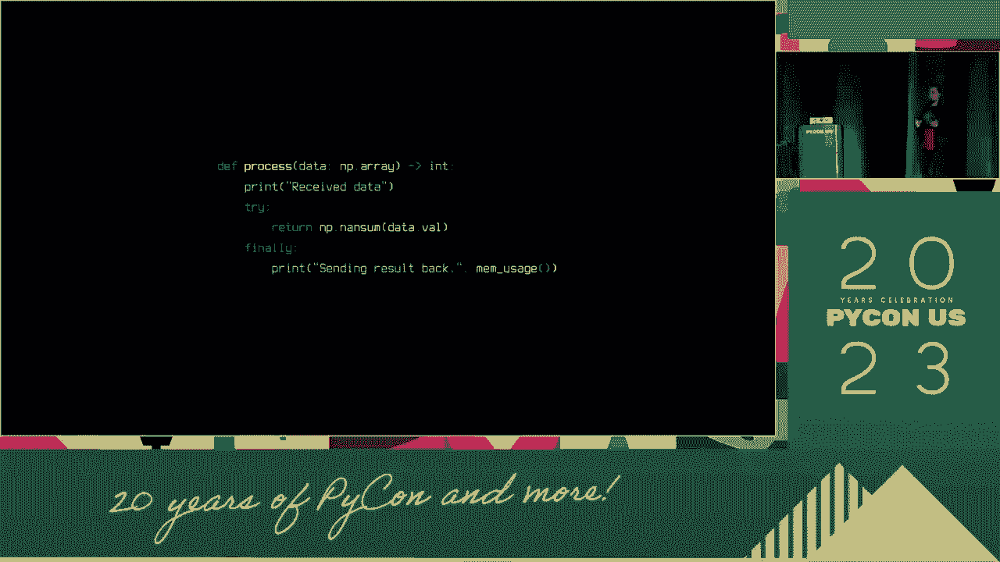

 But don't mind this is just an example， but it shows up processing the dot-hole。 The dot holds off this thread on instant all from doing anything else。

 You think they always want to have a very short moment of processing so that you can go back。 to the even-driven app。 Do you have anything else for them？ Otherwise， you can't have an release。

 Of course， all the other requests， responses， or health tips。 or two-million-ish functions that you have in your application， and so on and so on。 So。

 this is like an example， because you are in the non-buyer， and you think that is that。 So。 you will be kind of breaking this down on through multiple processes。

 Yeah。 Okay。

 Okay。 Main， interesting， but there's not much interesting things that happen here。 even though there's a few lines。 The most important thing here is that we are using our process for every single form as an array。

 And we can say one more thing， we can say a hundred or a hundred or a hundred。 One more thing here is we have all these data， right， that is given to us as we include arguments。

 only or something like into batches， and into those batches， you are running in unexecuted， right？

 So， you've got run and a digital run or talk a function with this slice of data。 This slice of data is going to be a specific amount by far， and then we're waiting for results。

 which is single or wait for。 We have very， so， instance， I have a wait。 Only to onward with summing up the result， which is the final phase of master's use。

 where the using of bachelor's vaults can be a total sum。 Well， so。 you can actually have many work so that you can have one， and you can have multiple。 So。

 how do we run the entire thing？ Well， you can see that we can go to a system of slide where we can get the process model。 or to be able to actually implement that data later on， and just slide it。

 We wrote a data from our pickle file， and then we're going to use the data to run our main system function。 So， how does this look like for a single worker？ A single worker will take a little under one whole 60 seconds to complete。

 for two billion records， the maybe that's not for bad， but， well。 my last I had more than a single score。 So， how about we add more workers to this？ So， we add four。

 and it's only a 59， now。 The fourth goal is that I have 10 scores next to it。 So。 let's introduce more workers， and see if it's faster with 10。

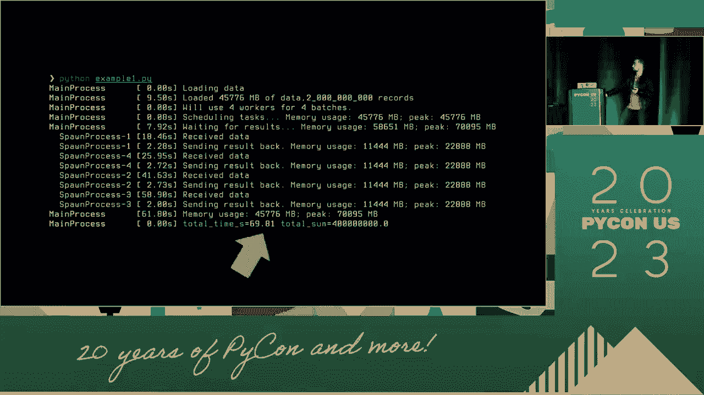

 It's not。 And， maybe we add it。 Maybe we can pull on a slide already in the white exhibit。 but it is quite a bit of a function。 We don't know how to include it。

 The function one is that it takes our own problem， or any worker's process， even on your team。 or a billion。 The third worker's process wastes almost 10 seconds to get a new thing that we can work with。

 and the last one waits over a minute to do anything。 So， the fact that these two are more capable。 whether it will help us at all， build this algorithm until they get to zero。 And， what do we want？

 Well， our new thing is new of the world。 At this point， we have this one main process that's。 a very applicable worker than the previous one。 But， in truth。

 there is a little more subtle issue there。 We have to serialize the data first to pass it to a top player。 which in turn just gives zero， liability。 We are using people for this。

 so there's a good thing on the bounce side and I'm pushing on the view side。 And the problem there is that there is only one deposit。 So， there can only be one deposit。

 but that's all the fitting of this entire 45-year data。 And this is obviously an issue。 We need to have to do something about it。 Better， if you actually see what is happening。

 the example is extremely philosophical because it takes 10 seconds to get the data and then zero point。 only one second could compute for a lot。 So， obviously。

 adding more workers to this only make matters worse。 I think it makes no sense to operate like this。 But， in fact， I would go rocky。 And， uh， serialize itself by mistake because if it was bidding。

 you would run out of memory。 The main problem already takes 50 gigs of memory and it seems that the worker processes would remain in case 4。5 gigs at the same time， but one would be in trouble in my luck work。

 I would use the start-slap in any memory。 That would be very mechanical。 So， what can we do？ Well。 we can use this for an online account。 Well， in fact， or else， one would be next， that would be the。

 。is the。 。is the course of 4。 So， in a hard process， we have a program， uh， point-barre。 and two-rate， we make this much more than an exit field and it has to be a segment in memory。

 It can stay 4， you'll see it in a house possible。 From the process that you're already on。 So。 my only way to do it is you would decrease an instant memory for the program and an instant memory for the data。

 And you'd switch the form to somewhere and it's our process and it's our running。 The problem with that is that it's going to be slow because it's the process of leaving out of memory。

 copying this all， like， the visual type space， it's pretty， you know， 10 consumers。 So， for a 4。2-in-5， let me see if it's a case where it just avoids how the program uses the memory。

 and as long as it's only in memory， we don't really need to copy the files on the menu space。 Only if the time for child needed any of the data。

 now you actually have to keep your own perspective properly。 So， including W。B。 unimprovement for it。 Or in fact， if it's not because Python's memory management is such a way to boost up even objects for me。

 create memory rights。 Because of our garbage products， we're just here。 Having a buffer flow。 I created an instant， I'd say， let's add this new 3 functionality that at a time would really involve Instagram。

 and then， you know， for me， please start the server。 Please。 for an object so that they will never be mutated by Python's garbage products。

 so that's what you're unerided actually being useful。 But in our case。 if you want to ever have more than one data set to be in a role to our program。

 that is what we're just going to help with。 Because， you know。 if any of you need one to be able to process the data out of the car。

 and so just leave in terms of not sensible， but now about the purpose of the ordeal or。 as we've called， pop into a tool。 Honestly， very clever about this， this is often very promising。

 obviously， to Python。 What it does is it allows us to have an in-go process。 how multiple isolated and， difficult， so we are in attendance。

 and in attendance is the key word for it。 We don't have any data for it。 Objects of the one individual are invisible to the other individual。 So， suddenly。

 there is no kind way to say data there。 All of the time implemented it。 because then the main fifty-two makes sure that one individual does not step on another's toes。

 in the same process。 We can also achieve it， but these four have some work there in the future to actually make the Australian better matters or you can use from this thing。 And again， that's the opportunity for all of the people to be well， so by the time you get to it。

 you're going to be able to help。 So， what we want is， here is the mainly。 The main topic of this talk is that， I'm moving on to the instance of a future operating system all around。

 It's supported by Windows。 It's supported by my Mac OS。 Obviously， it works in Linux。 So。 I'm currently surprised it's not in a more popular way。 So。

 we're going to be using it in a Linux program。 And it just seems like you have to make the online system that you have to add。 And fundamentally， it's not entirely that complicated。 We're going to be doing it。

 We're going to be using a third-manly manager。

 And with a third-manly manager， we're calling a third-manly segment。 So， in today's topic。 we'll be seeing how let's say it's as a bit as a data set up in a minute。

 If you have a production application， we probably want it to be bigger。 I would say that it's a bit of a request later on， which I'm still excited。

 I would say that we can really just say the same size of bytes as the data that we're enjoying。 And then we can use the number of magic powers， which is to create an array not to existing in a new buffer。

 If you do here， then we just copy our people to the third-manly。 It is a little annoying。 I have to copy here。 And it's not a funnel。 I mean。

 I do need to call for the brain to write to a third-manly directory or some form。 Or we could use everything。 This is the relation method that we write to this third-manly array for the main directory。

 But it is one of these points， which is， for example， just haven't learned that。 Not only do you have to copy it， I can see it。 But this one is happening on the main service once。

 and then we don't have to do anything ever again。 So， this one was the old situation。 We use not our main function except the data。 So， we're going to need that as we were talking arguments through the process function in the editor。

 We're going to continue in this slide now， because we don't want to actually copy data to the process function。 And so， what we want to do is we want to use the old community to third-manly run the work with the floor。

 So， now we will be owning copy of tiny metadata， right？ So。 the process function will accept the short-moment segments in。

 The short-moment segments in the data are so that you can use it directly with non-buy on the work side。 But you can't throw a number of those how big some elements in the work side and some windowing。 So。

 you know， it's going to be an offset on a batch size that is working to know about it。 Because now you have to since many of the segment that we've shared。

 and you have to tell it's work like that you view it's good for it。 whereas the other worker would view it's good for it and so on and so on。

 and then all the other ones are not very good for it。 So。 now we already post-the metadata to the purpose function。

 and we need to modify the process function。 So， before it was nice and clean。 now it's going to be only nice and clean， but to build a close-beat as possible。

 it might have grown out， you know， to be sure， right？ You can give it a little more argument。 All I like is transportation。 So， yeah， other than not。

 we just clean the language that we've been to， said。 went back with the name that we need to have provided。 And again。

 we create the array from an existing buffer。 We don't need to cook it through it anymore。 We can use whatever is already there。 Or we can actually use the non-submarine。

 But now we have to use our window for our offset on the batch size to cross over some or the settings that we want。

 And it does mean that's it。 So now， when we have all this。 there is no data coming through the process anymore， only calling the creator。

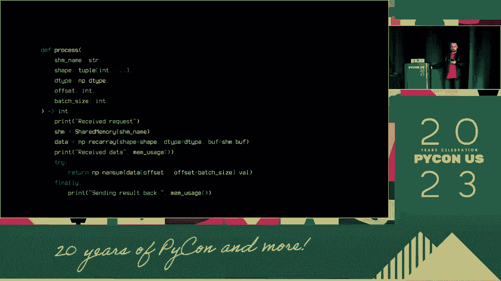

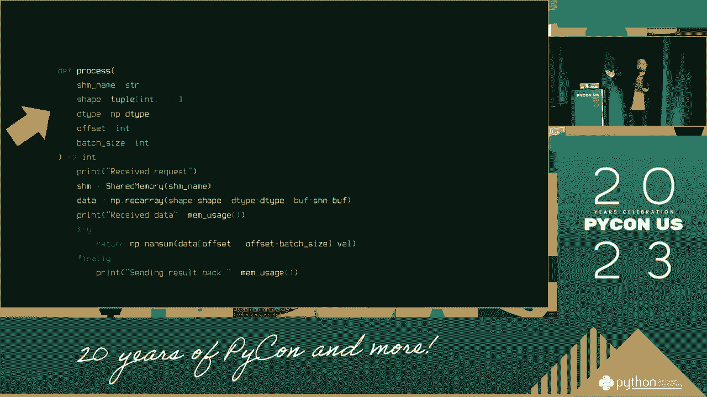

 This is awesome because the situation before we got the serial vision and the serial vision picked our own time。 This is no going away。 We're still still alive and into alive and only now we're doing this on only the issue of information。

 right？ We talk to the worker software。 We have a good question。 And， you know。 it was then a very quick response to how to serialize this。 So many people don't need information。

 But now， with those necessary data， we are able to access the statement about directly from the worker。 So， how fast it will move the second。 So， yeah， that's mainly the 25-S improvement that I told it。

 So， let me show you the slide again。 Cool， we won。 This is the excited。 There are some problems。 So。 you know， I'm on the spectrum。 I'm going to try to get it in my board and write it in my eyes。 But。

 25-S， you can。 Anyway， now we actually see that the time to receive the response is essentially。 we can just ignore it。 The first process， the first worker software in the last worker software。

 which is the request essentially after same time， which is what we wanted。 We think that there is a time only because time is planned for actually between the end of the year and the end of the year。

 And the time only is planned for the worker。 But， sure， as well， for any other second storage。 it's also time to protect what we want before。 So， that's it。

 And then the process is actually not because now， like， then there's periodically in power。 Like。 the software is one-plus is five， it's five， so then one-plus is nine。

 And then it's called one-plus is four， and then you can see that in all of the storage。 but they all converge。 And actually， it's called back-by-roll， which is awesome。

 And the nicer thing is that the product， how it works right now。 we can mainly use it with five times slower， but an actual memory， which。

 as the time was going back， it just has to be zero。 And we're not really needing many， anymore。 I would switch this one-point number。 So， it's often。

 I would note that the topic is why you need to take a second time on actually doing the total to restore memory settings。 And this is， again， something that will be cool， but it could do it。 Or。

 if you have a little bit of a "no，" that's just a road to show memory， you actually take a second。 But I'll just leave this up for more to you。 Since we've been considering to keep five times， like。

 we're moving into those awesome times， where， like， what do they work on， like， they're even good。 So， anyway， even if you like it， this is not so horrible， you will always be stuck with this。

 If you still combine those two numbers， it's still five times faster than your serialized memory。 so it's still worth it。 And here we have， here we have， here you're awesome。

 because there's no serialization。 Overhead， 2-power， up to 2-power data， and， yes。 overall memory consumption。 On this right side， I used to， I could see that it was more code。

 and you actually have to assign it all。 This is called memory， memory。 memory and the programming name。 You have to pop well， then you know。

 from a site with four off-the-back and every time you have to save， there's different， more code。 And more important， it probably gives you advantage to that with 2-power， up-to-3-4 data。

 I realize that I also listed it as an advantage， but if you actually mutate the code data from one of the processes。 you might end up in a situation where the data structure is flat， complete， not mutated。

 It's not serious， don't do anything， and another process actually can currently， actually。 in parallel， is actually limited as flat-rate processes。 So， if you're a fully-made sub-cell。

 but if you really want to put a rating， it works again。 So。 if you need to use this in my phone to make sure that you're not putting on a set of thousand。

 when you're mutating your data， you need to do this explicitly。 And you're in a nice helper。 and the two of my main supports， and if you go through that， that can help you。

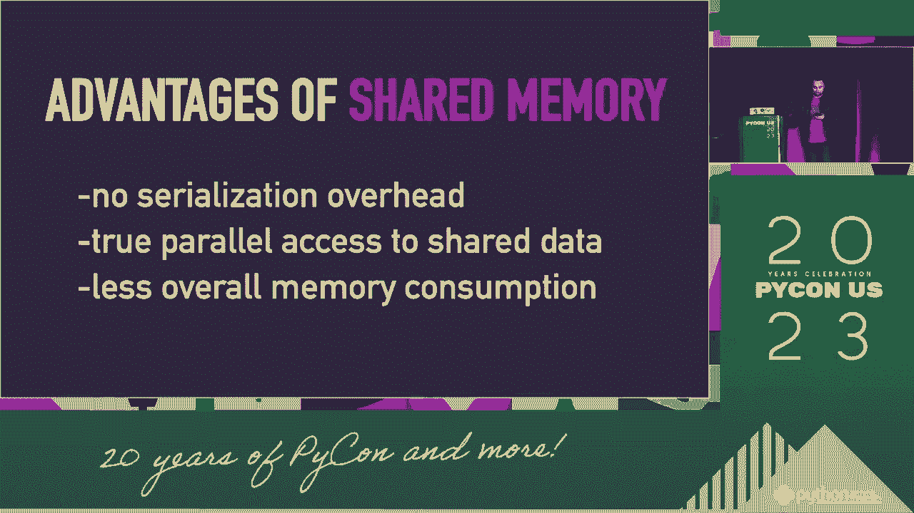

 And if you still do， let's go and try out Windows， because I promised you that for a memory。 it was there too。 And in fact， starting yesterday， when I actually reminded me about how to do it。

 the Windows version of Python is actually 11 as well。 So， if you download Windows。 and Python from Windows， you're going to get 3。11 at the moment。 So。

 if you do and start it on PowerShell， we can now see that for many seconds， but not on the all-on。 but one called a terrible risk。 And inside the server， you can see things you can see bytes。

 you can see numbers， non-enboliants， and that's the beginning。 You can do all of it， but do it。 I mean， it's a way for it to be connected， so it could be cool。

 And another process that actually using the same name was on the next set length。 which is the middle-to-side level。 So， for the cool， we can do things。

 We can write some time-thumbs on it。 We can't write some time-thumbs。 because time-thumbs are this very， very simple object， and those are not supported。 With many types。

 what you can do is you can find some way， if you're right， when you're too primitive， like。 in which case you're too certain again。 Like， if you ever use this one， you'll notice both。 So。

 here we can， for example， use the time-thumbs method， or the data object， to put it in work。 and we can make the data object in the other end， boom， it's the same one。 All in the into it。

 but now we're about to end this new and into our new conditions， so。 if you're going to be doing this a lot， you're going to slow you down， right？ So。

 let's do now what you're doing。 And most of the time， it's just an extension of the test。 if you're moving back。 But when you are， the nice thing is that the new patients of their server are the current。

 And they're never going to end up in a situation where， I'm not big enough to be there。 and not know。 That's not going to happen to you， which is great， in terms of consistency。

 And they're known by example， they were used before， which is a map on non-type array， or the。 how to say， the， you know， the 7-level memory。 But if there are any changes of the speech or the other side。

 that we know about it， there's going to be a test。 Here， yes， my turn。 Okay， so， another example。 looks to say that it's not denied in this book。 It's important， so we call it a language。

 we know that I know。 It's not able to put one thing in one unit， I mean。
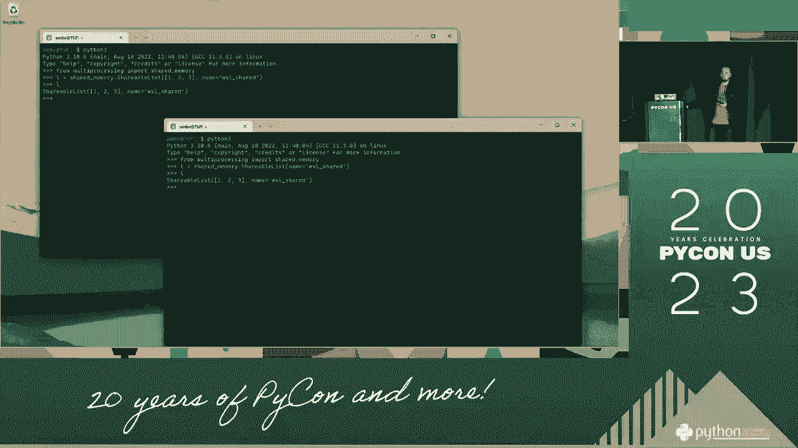

 So， I know， I know， one of you would actually write food。 All of you would， what you're telling。 can be just used as a social process， and you don't need to use a computer。

 so why do you always put time on a patient in your slide？ No， I mean。 it's in parallel in this slide。 So， no， like， I think there was often。

 because this is not your process in there， you can add so many more things and put the first， right。 a whole thing。 You can add progress monitoring， you can embed whatever you put here in the folder。

 as you already have， or how to put this。 So， I think there are conclusions that you're in nicely in this sort of way。 that you know， I think there are which parts of the idea， and whatnot， like。

 all the people who use it， so like， there's no excuse， because it is the way to write type on。 in ways that the task has to go。 Like， you know， if you really want task servers。

 that's how you step through。 So， I would really suggest you look at it。 So， we'll also because。 since you are really doing things that are， you know， dealing with multiple things in this slide。

 so concurrent things。 And， however you do， you know， the experience， or you think I know。 or do you think I know， don't you do that。 But， you know， there are multiple ways to do that。

 You're going to have to send it away。 And now， you can send it away。 and then you can send it away in an already elegant way。 So， what I think is， this before。

 I showed you this copy page， where everything is common。

 and there are no type of things， because nothing ever fails。 And this is my story。 and I took almost five minutes to talk right now。 And this is so awesome。 And then。

 you can talk about it。 So， let's synthesize a theory in our process function by saying， you know。 it was a little short， whenever it's， it's 4th or 6th or 11th， whatever， or。

 2th or 4th or EDD and it's up in the degree。 So， okay， that's the theory， you know。
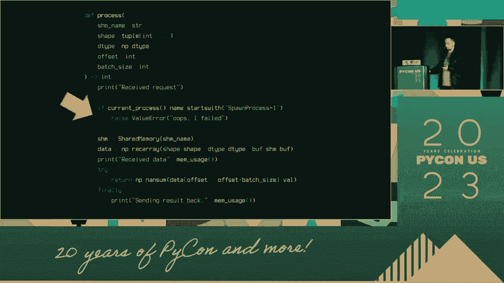

 And as you learn this in our technical code， in order to get rid of the whole thing。 it's what we've got。

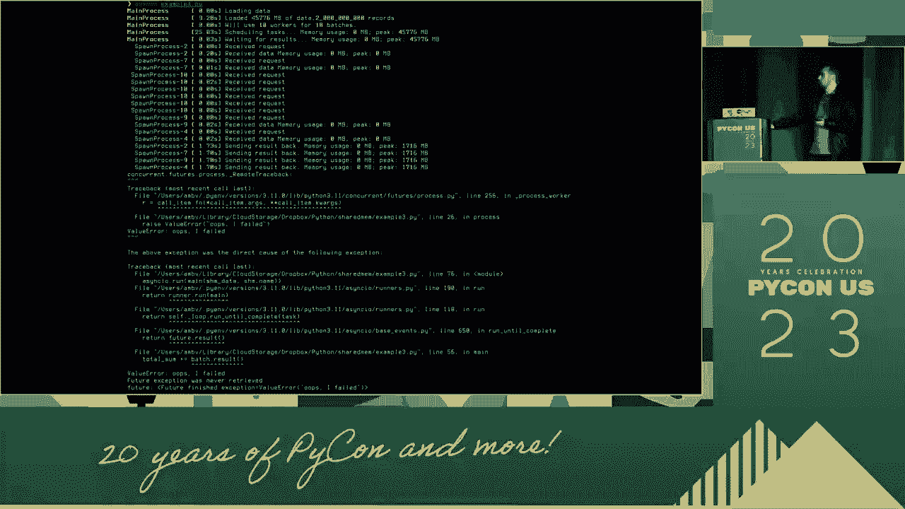

 I don't expect you to be able to read this。 It just goes on exactly right， like where the value is。 but what you can also notice， is that， oh， it's been meaningful to book fully touched。

 because this is one word for something。 Okay， let's talk。 I wish you'd be something about it。 So。 what you can do is， you can drop this form here around the side， so it says， well。

 if you try to get my result and then go to an exception and say， we're going to catch it。 and we're timing。 But， you know， you're going to get one exception from the back。

 and then you're in the except for all in your bottom。 This is the most thing that you can do in your own format。 So。

 many of you have observed all the exceptions by signs in the story。 and then you have to gather them somewhere， and then you have to do something mainly with them。 So。

 I'm not only， but most importantly， and if I'm on it this way， before the region。 where there are no prior texts here， I think I should be forgotten。

 It's really easy to just forget when you're excited about getting something wrong， and it's just。 you know， it's just making wrong。 And then， you know， you're going to go ahead and， you know。

 now it's the， you know， phone calls problem with the country's SVAN。 So， now， let's go through that。 Like， instead， now， in C-11， you can use touch-through。 It means touch-through to the ancient risk。

 the， Bosec-Bosec-Bosec-Bte-Gin。 You have a rock in which the other eye， what can happen？ Oh。 because what is happening now is you're commuting to the inside-the-top-through。

 and the past will guarantee that by the time you're in the touch-through， right。 so you leave the ancient rock， all the past are done。 So， there are not going to be any longer。

 It's time you know that everything is coming。 And what is going on in C-11？ What is going on？

 Because those are multiple processes that are really running in power。 and they can be mainly accepted。 In this place， we're going to take everything out by default。

 You don't have to do anything， whether there are no run or a task。 All these things are concrete。 rain， and the other things that you think are great。 So。

 if you don't actually add any other type of stuff， you can see that you can see all of these things。 You now have an exception to the roots， so if there are many exceptions to it。

 you have all of them roots for it， so you can actually see all of them at once。 But。 whether it's essentially used， a high-century 11-act-act-down， which is already there。

 you can already react to those exceptions。 Because they're not the root。 you also ignore the kinds of unacceptable times， as I said before。

 this will actually be important overall。 And with those changes， you get colors now， essentially。

 So， this is actually called in the sense that even if you forgot about the prior step。

 even if you forgot about the kind of thought and exception part。
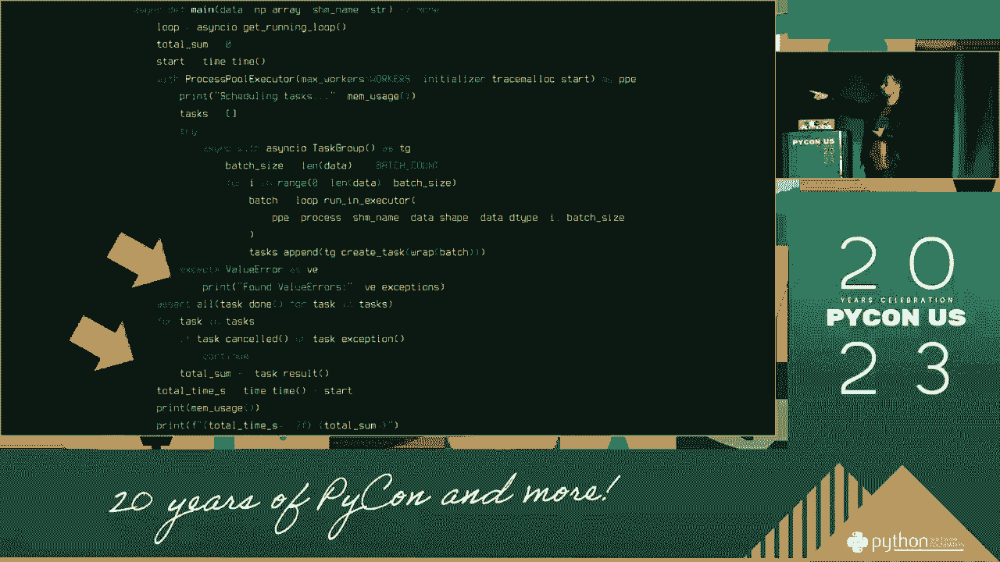

 if you just defaulted to using fast foods， it would always tell you， right away。 that something went wrong， there's an exception in the root。

 And you would not have any tasks that are only in making it harder for you to stop。 by in your application with a central key or however else。 You defaulted to the actual。

 when you change it， so I think about the central world。 because it makes it much easier to start your approach correctly。

 Everything that is within the essential will be dealt with by the human root。 done with the essential。 You can obviously， if you're going to put a link there。

 an amazingly essential makes it worse， that's it will only cancel the part that is inside the block。 Which is a close-in-time time。 So， it's only a 60-hour-degree time， but it's amazing。 So。

 I'm really happy about just what's on this phone， or even if it's in the middle。 or if it's even with thread。 It's really normal for us in our country。

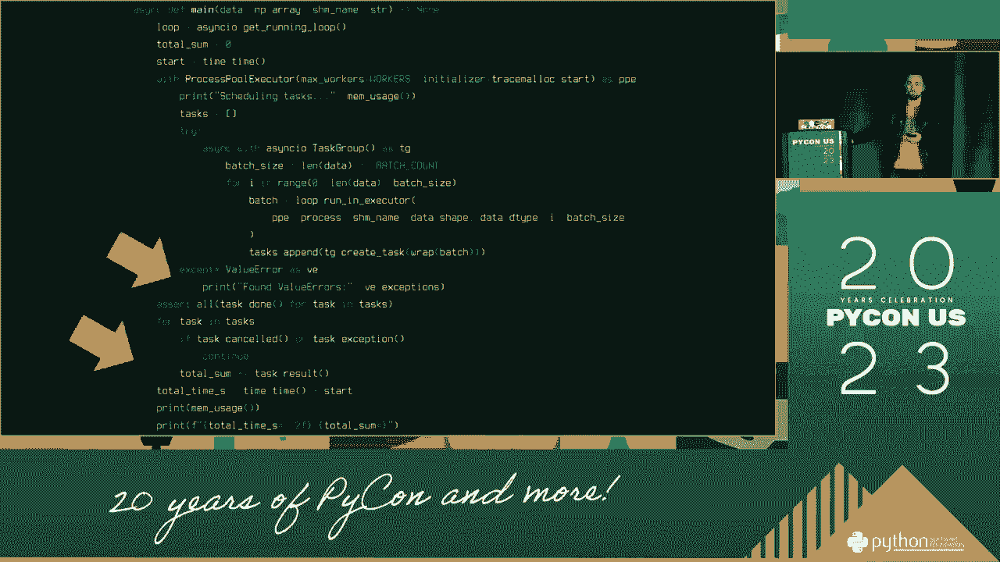

 So， anyway， if I fail， and we can move on to。
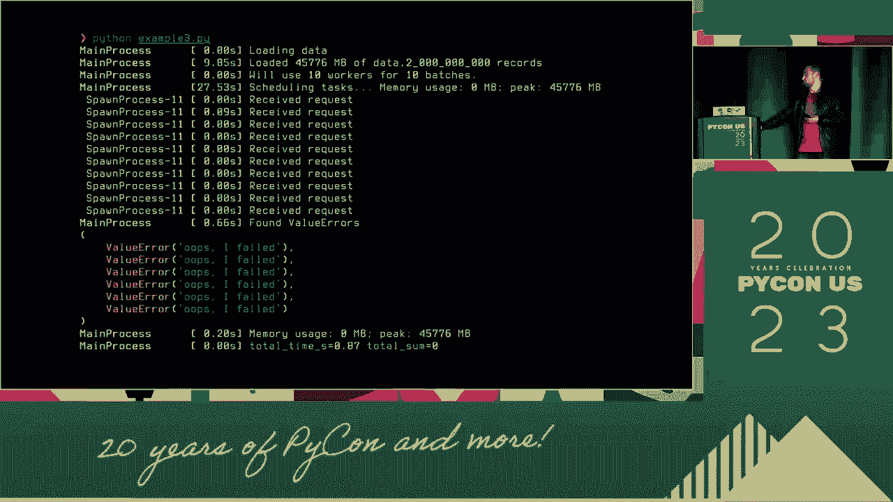

 I actually made them into our 45-minute talk， only about exit store in the 50-day store。 If you're like， "That's cool， but here you do， and explain this well。"。

 And you can give me another 10， and if I still fail， then my answer is no。 You can just read this question， and I'll send it back in。 So， again。

 what about the 50-day store in your exit and you can move them in， right？ No。 And then， you know。 I'm not， there is no exit shooter in your country。

 but it allows us to use public works of this emergency。 as we have shared and also to exit the issue。 But， again， homework， like， there's a few people here。

 like， might be your contribution。 I invite you to， actually， play with Paitano。 If you are reading some times， you may be able to read it。

 My name is Luca Panda。 I'm really happy to be here。 Thanks for your presentation。 I'm with you some questions， but I'm here to read our events。

 so you can ask me if there are some questions。 [ Pause ]。
