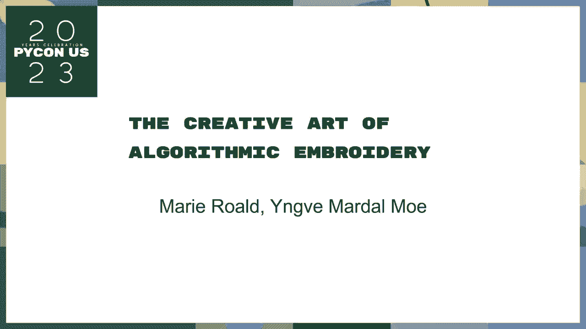
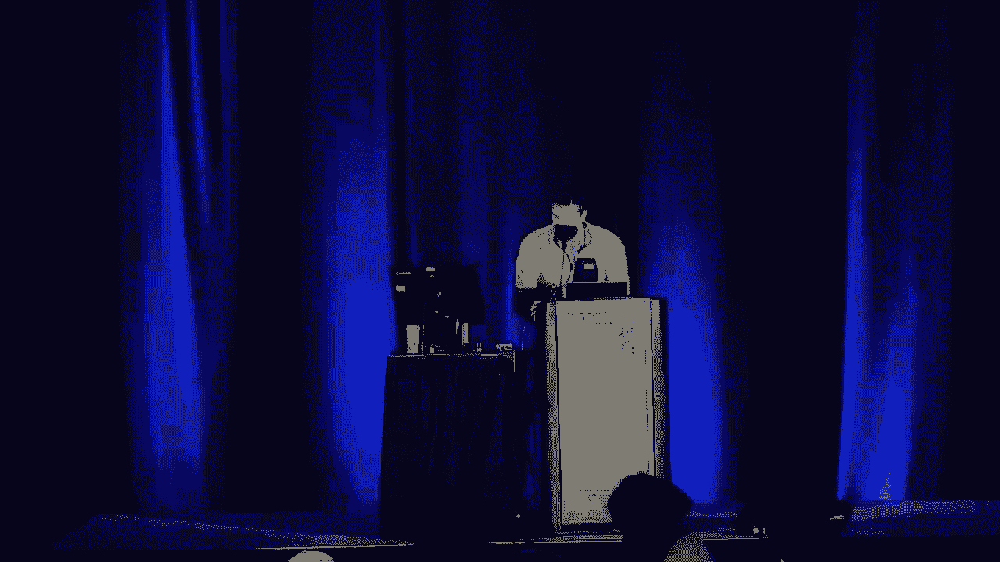
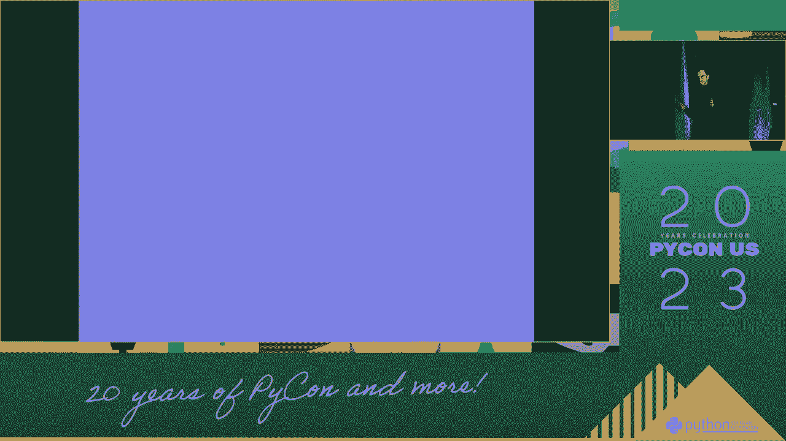
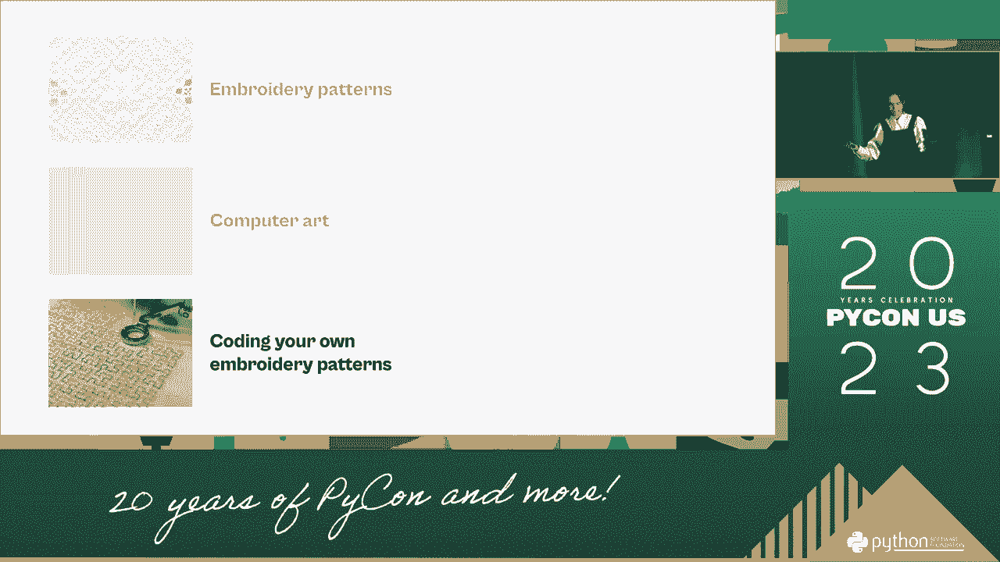
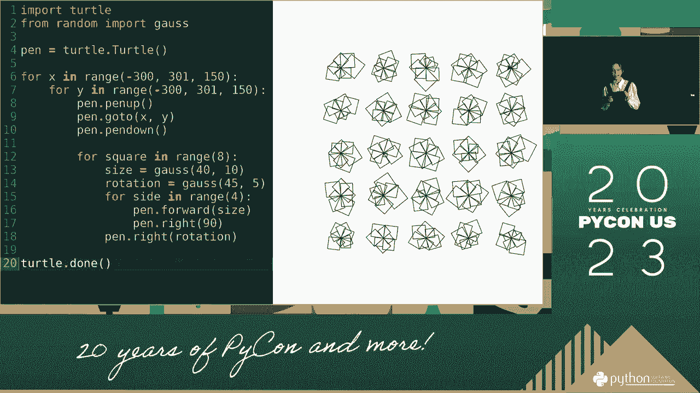
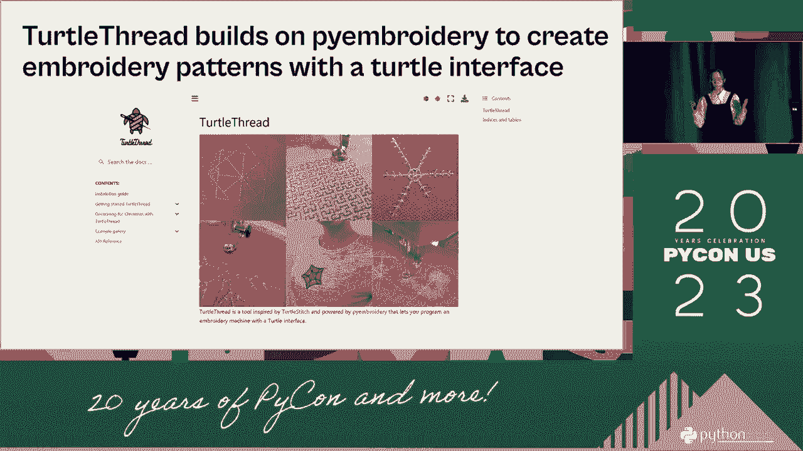
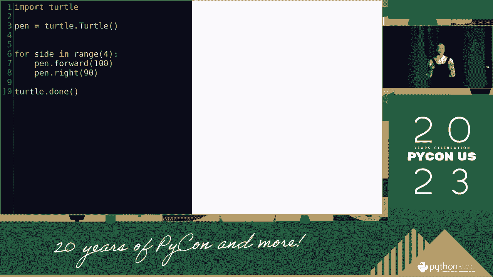
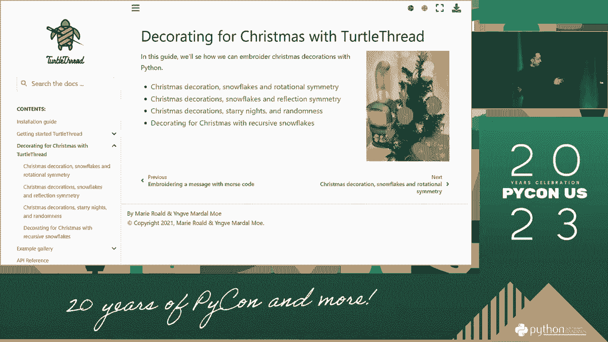

# P49：Talks - Marie Roald, Yngve Mardal Moe_ The creative art of algorithmic embroider - VikingDen7 - BV1114y1o7c5

 Welcome back everyone for our final session。 This is a wonderful one we're going to talk about in the world。

 Maybe I talked to us about the creative arts and algorithmic。

 environment。 How are you sounding at that kind of。we're the folks I want to embrace when you're talking about it。

 I want to know the words of what is the connection between the global concept and the community arts。 And how can you type in code to include a variety of topics in a way that has more than five or five people to please have the goodness and support。

 Oh my god， this is a game art。 And we use all of our three questions。 In fact。 a ball can be a development。 We were able to make a new world。 But in fact。

 we were able to make a new world。 People were talking about making things like this， which we love。 But we were beginning to get a little bit of drug out and everything being so difficult for us。

 So we were beginning to look at the coding process。 Where does it find？

 So we were increasingly happy to find a game to use our coding code because it's a new triangle to pull us out of the city。 So when we learned about the building， when it's followed up by a new program。

 we were increasingly happy。 Which is a form of an important part of learning about the building itself。 It's a story in computer art where you think that all the learning happens using its typing code。

 So we will just share a little bit of this time， and then， and all of it。 Next slide。 let's talk about conversion。 So what are the articles of programming？

 You want to make sure it's better than the programming process。 First up， new。 You can use this to keep the flow forward。 This is also a complex algorithm。

 It's a simple building book of competition。 In our think-off。 I used to think you were a specific institution。 This is a topic of competition that means you're specific and you're talking。

 Special is an ordinary person to think where simple geometric plays。 which is often a signature case。 Or a team to be from an intricate competition。

 And a tradition is organized through a pair of strengths and costs。 If you look at this topic。 it's made of these two pieces of things。 World-based things。

 Black work is a common segment right here， where just friends， if you simply do a white credential。 it will take you a while。 Right now， it's been from German 5700。

 where the Muslim population is staying generally right now。 And it is very popular among British lawyers。 This portion of the title of the "Dame's Year" is written up and written with the "Mister's Book" work。

 If you do put forth this project， you can be producing that。 Another type of politics that you go into is a "Dame's Town" or "Nuriki White work"。

 And this is a very famous or popular person。 It's been the same class of politics， the most famous。 most famous， the most famous， the most famous， in Norway。

 we sometimes call this a "seidur" but it occurs all over the world， like here。 only came in the development。 What we've seen here is that we think of what we can see in full-person。

 which we think are in this hope， which we， as programmers， are very familiar。 It's also very violent and invarinated。 In other situations。

 we need to welcome programming into the environment。 The environment is also associated with invar。 and， the world is also associated with the "Dame's Town" and the "Dame's Town" is also associated with the "Dame's Town" and "Nuriki White work"。

 The final program in concept is recursion。 It's under pain， any divide and cultural algorithm。 There is also a engagement in origin。 We have been interested in embroidery。

 But we are only on the other side of the country that has been not stimulating at all。 And it's a border platform in particular。 We are very clear in the new hope and narrative in terms of our country。

 In this talk， it's made of smaller topics， they are made of smaller topics。 and they are made of smaller topics。 Now， this is the only small structure of the head club。

 The whole thing is related to the many of you that still happen。 Now。 we are just curious to see things。 And if you are interested in anything inviting into the same laboratory。

 then this is the most impressive that we either recommend。 And it's also worth mentioning that in only great literature of tiny amount of embroidery to structure。

 there are so many spiritual files in the world， so all over the world。 we could be talking today about probably nearly everything。

 So what we're seeing is that we can find a programming process。 and people are talking about how to make things look like programming， this is not a need。

 a question， but we have a decade ago， and it's not created according to any of our other computer artists。 And if I am in it or consider art， I do not have the same concept that we have today。

 This is a way of making it。 Because I take the code， turning it into a blank card。 turning it into a journal， and then that way it can have a new experience， a cardboard or paper。

 and it can't ignore our work by the way。 And it's built between the more networked。 I bring it by a micro-mode which is used only in repetition。 It's a way of almost two-piece。

 like having expired， by current， by data-pliers。 For this， I take a sample。 with the recreation of software or gravel by building it。

 it gives only a particular environment to create this， so that's really the configuration section。 Moving on to opening， just a particular environment to create this work。

 will make more lines around the neighborhood section， because it's like a presentation。 Now。 this one was particularly cumbersome to make， so even all of these four lines。 So。

 the idea in many physical coffee projects。

 to buy the a-case， and then add a-case， with the first one。 it was a lot easier to create this work to make。 So， a particular statement of a paper product。

 if it's not a paper formula。

 [silence]， I really like this one。 In very physical， physical， and it is built for this。 it is built for this， so people are able to create this too much made by different people。

 It's very similar to the work that not been about from here to here。 Now。 what we're seeing right is that we're looking at the pieces in randomness。

 of creating a paper product and a paper product。 And another programming issue。 that we cannot integrate a product， is recurricular。 To create something else。

 here we can abandon my system， which is a type of proposal。 and this particular linearization that can make more diversity resemble only。 Now， again。

 we are just curious and easy to say。 If you want to need more about creative coding。 and if you are a computer artist， and you're still at the top， then you're still at the top。

 and you're still at the top， and you're still at the top， and you're very， very motivated。 So。 we can find something that we can't integrate。 Now， we can create a person's each parameter。 But。

 what we believe is about the building itself， is that we can't do it。

 We can create a simple line of creativity。 To go on and back up。 we can use the building line right here， so we start by important thinking。 So， to go online。

 we first create a prototype， and then call the product。 So。 forward thinking the number of folks who are familiar with the product。

 and then we just create a product of it。 And now we're going to go ahead and call title。 And if you have a couple of minutes， we'll finish the deadline， so we'll get to the future。 So。

 what about the next， I'll go to the next， and then we'll run this code。 So。 we can single-speed a line of mine， and then we can quickly， but we can。

 that we can really finish it over the radio， and we can open a line of questions。 So。 let's use the application。 And then we can provide a line of some create for it， through the future。

 so that we can。 So， we can also go ahead and call the product。 And we'll go ahead and call the product。 And we'll go ahead and call the product。

 And we'll go ahead and call the product。 And we'll go ahead and call the product。 And we'll go ahead and call the product。 And we'll go ahead and call the product。

 And we'll go ahead and call the product。 And we'll go ahead and call the product。 And we'll go ahead and call the product。 And we'll go ahead and call the product。

 And we'll go ahead and call the product。 And we'll go ahead and call the product。 And we'll go ahead and call the product。 And we'll go ahead and call the product。

 And we'll go ahead and call the product。 And we'll go ahead and call the product。 And we'll go ahead and call the product。 And we'll go ahead and call the product。

 And we'll go ahead and call the product。 And we'll go ahead and call the product。 And we'll go ahead and call the product。 And we'll go ahead and call the product。

 And we'll go ahead and call the product。 And we'll go ahead and call the product。 And we'll go ahead and call the product。 And we'll go ahead and call the product。

 And we'll go ahead and call the product。 And we'll go ahead and call the product。 And we'll go ahead and call the product。 And we'll go ahead and call the product。

 And we'll go ahead and call the product。 And we'll go ahead and call the product。 And we'll go ahead and call the product。 And we'll go ahead and call the product。

 And we'll go ahead and call the product。 And we'll go ahead and call the product。 And we'll go ahead and call the product。 And we'll go ahead and call the product。

 And we'll go ahead and call the product。 And we'll go ahead and call the product。 And we'll go ahead and call the product。 And we'll go ahead and call the product。

 And we'll go ahead and call the product。 And we'll go ahead and call the product。 And we'll go ahead and call the product。 And we'll go ahead and call the product。

 And we'll go ahead and call the product。 And we'll go ahead and call the product。 And we'll go ahead and call the product。 And we'll be able to make a circle with our void。

 So we need to give it 4。0。 And we need to make a circle with our void。 And we need to make a circle with our void。 So we need to make a circle with our void。

 And we need to make a circle with our void。 And we'll let's make a little bit of this thing。 So we can make a circle with our void。

 And we can make a circle with our void。 And we can make a circle with our void。 And we'll also make a little bit of this thing。 So we can make a circle with our void。

 And we'll make a circle with our void。 So we can make a circle with our void。 And we can make a circle with our void。 And we can make a circle with our void。

 And we can make a circle with our void。 And we can make a circle with our void。 For example。 by inviting them into the party。 That's a great question from my example。

 We make a little bit of some options。 We found a little bit of this。 We can make a circle with our void。 And we can make a circle with our void。

 We can make a circle with our void。 So we can make a circle with our void。 And we can make a circle with our void。 And we can make a circle with our void。

 And we can make a circle with our void。 And we can make a circle with our void。 And we can make a circle with our void。 And we can make a circle with our void。

 And we can make a circle with our void。 And we can make a circle with our void。 And we can make a circle with our void。 And we can make a circle with our void。

 And we can make a circle with our void。 And we can make a circle with our void。 And we can make a circle with our void。 And we can make a circle with our void。

 So we can make， we can make code by the moment we go around。 But we can make a square of void in the field。 Then from it into source of fields。

 And we can make a circle with our void in the field。 We can make a circle with our void。 And then we can make a circle with our void。 But we can make a circle with our void。

 And then we can make a circle with our void inside。 Open your mouth。 You can see the circle in your circle with your void。

 So we can make a circle with our void in the field。 And then we can make a circle with our void。 And then we can make a circle with our void。 And then we can make a circle with our void。

 And then we can make a circle with our void。 And then we can make a circle with our void。 And then we can make a circle with our void in the field。 And finally。

 we can make a circle with our void。 And then we can make a circle with our void in the field。 And then we can make a circle with our void in the field。

 And then we can make a circle with our void in the field。 And then we can make a circle with our void in the field。

 And then we can make a circle with our void in the field。 And then we can make a circle with our void in the field。

 And then we can make a circle with our void in the field。 And then we can make a circle with our void in the field。

 And then we can make a circle with our void in the field。 And then we can make a circle with our void in the field。

 And then we can make a circle with our void in the field。 And then we can make a circle with our void in the field。

 And then we can make a circle with our void in the field。 And then we can make a circle with our void in the field。

 And then we can make a circle with our void in the field。 And then we can make a circle with our void in the field。

 And then we can make a circle with our void in the field。 And then we can make a circle with our void in the field。

 And then we can make a circle with our void in the field。 And then we can make a circle with our void in the field。

 And then we can make a circle with our void in the field。 And then we can make a circle with our void in the field。

 And then we can make a circle with our void in the field。 And then we can make a circle with our void in the field。

 And then we can make a circle with our void in the field。 And then we can make a circle with our void in the field。

 And then we can make a circle with our void in the field。 And then we can make a circle with our void in the field。

 And then we can make a circle with our void in the field。 And then we can make a circle with our void in the field。

 And then we can make a circle with our void in the field。 And then we can make a circle with our void in the field。

 And then we can make a circle with our void in the field。 And then we can make a circle with our void in the field。

 And then we can make a circle with our void in the field。 And then we can make a circle with our void in the field。

 And then we can make a circle with our void in the field。 And then we can make a circle with our void in the field。

 And then we can make a circle with our void in the field。 And then we can make a circle with our void in the field。

 And then we can make a circle with our void in the field。 And then we can make a circle with our void in the field。

 And then we can make a circle with our void in the field。 And then we can make a circle with our void in the field。

 And then we can make a circle with our void in the field。 And then we can make a circle with our void in the field。

 And then we can make a circle with our void in the field。 And then we can make a circle with our void in the field。

 And then we can make a circle with our void in the field。 And then we can make a circle with our void in the field。

 And then we can make a circle with our void in the field。 And then we can make a circle with our void in the field。

 And then we can make a circle with our void in the field。 And then we can make a circle with our void in the field。

 And then we can make a circle with our void in the field。 And then we can make a circle with our void in the field。

 And then we can make a circle with our void in the field。 And then we can make a circle with our void in the field。

 And then we can make a circle with our void in the field。 And then we can make a circle with our void in the field。

 And then we can make a circle with our void in the field。 And then we can make a circle with our void in the field。

 And then we can make a circle with our void in the field。 And then we can make a circle with our void in the field。

 And then we can make a circle with our void in the field。 And then we can make a circle with our void in the field。

 And then we can make a circle with our void in the field。 And then we can make a circle with our void in the field。

 And then we can make a circle with our void in the field。

 And then we can make a circle with our void in the field。 And then we can make a circle with our void in the field。

 And then we can make a circle with our void in the field。 And then we can make a circle with our void in the field。

 And then we can make a circle with our void in the field。 We can make a circle with our void in the field。 We can make a circle with our void in the field。

 And then we can make a circle with our void in the field。 And then we can make a circle with our void in the field。

 And then we can make a circle with our void in the field。 And then we can make a circle with our void in the field。

 And then we can make a circle with our void in the field。 And then we can make a circle with our void in the field。

 And then we can make a circle with our void in the field。 And then we can make a circle with our void in the field。

 And then we can make a circle with our void in the field。 And then we can make a circle with our void in the field。

 And then we can make a circle with our void in the field。 And then we can make a circle with our void in the field。

 And then we can make a circle with our void in the field。 And then we can make a circle with our void in the field。 (keyboard clicking)， [ Pause ]。

