# PyCon US 2020 - P17：Sponsor Workshop Xilinx, Inc. Patrick Lysaght - Extending the Python Ecosystem t - 程序员百科书 - BV1rW4y1v7YG

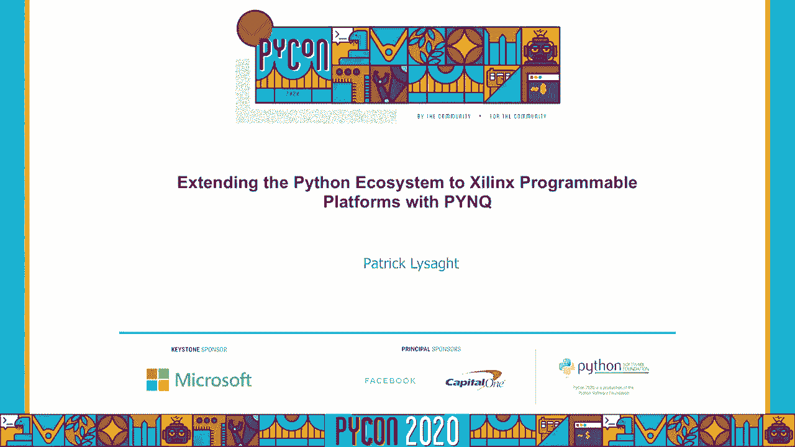

大家好，欢迎收看本节目，我叫帕特里克•利塞特，我是旧金山 xx研究实验室的高级主管，乔斯在加利福尼亚，今天，我要说的是，将蟒蛇生态系统扩展到紫英的可编程平台。

使用粉红色的开源框架和可编程平台 是芯片上的用户可定制系统，这给了你在你的项目和产品中进行创新的巨大机会，所以如果你对 python中的新硬件和新软件功能感兴趣，我们想这对你来说是个很好的谈话。

我们假设每个听众都对 python和 linux有一定的了解，你接触过树莓派和阿杜诺，你也许会对木星有所了解，木星计划，无论是木星笔记本还是木星实验室，我们希望你对开发很酷的硬件感兴趣，像我们一样。

你总是热衷于了解关于蟒蛇的新东西，一些新的可怕的能力，蟒蛇使，谈话本身分为六个部分，我们从动机开始，简单地看看平台的演变，然后我们讨论的机会是围绕锌可编程平台从 xx。

我们还将讨论我们从开源社区获得的灵感，尤其是蟒蛇和木星群落，在引入粉红色的开源框架之前，然后我们提供一些粉红色在行动中的演示，最后审查下一步措施，所以让我们从考虑平台开始。

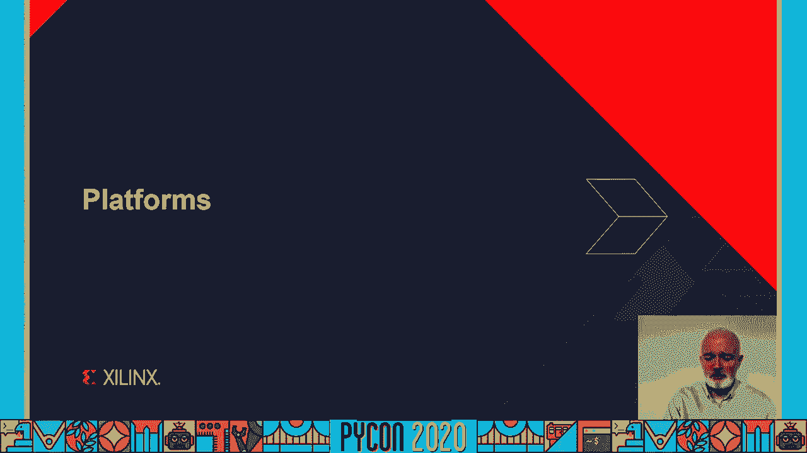

这次对平台的审查并不是为了全面，但为了突出我们在过去十年中看到的一些主要趋势，最大的趋势之一，当然，一直是树莓派，这是典型的功能强大的 ARM微处理器，在嵌入式系统中使用的小型开发板上。

新颖之处在于 微处理器现在已经足够强大，运行一个完整的桌面，Linux，和一个相当大的软件堆栈，这样我们就可以在目标开发上做，这意味着我们不需要进行交叉编译或交叉调试，所以它更容易也更快，相比之下。

阿杜伊诺，这是另一种现象，针对较低级别的软件栈，部署得更接近硬件，所以它通常可以控制传感器或读取传感器，和控制马达或执行器，在阿尔杜诺的微控制器的低层焦点，把它们描述成位敲击装置。

我们想考虑的第三类是fpga，它们增加了一个新的维度，FPGA不是 von neumann架构，FPGA代表现场可编程 gatorray，意思是现场可编程，如用户或客户可编程，逻辑门的集合。

它们的区别在于用户可以定义他们想要的架构，他们的目标应用，这让你可以发展出非常平行的，非常优化，快速解决问题，也提供了另一种程度的创新，人们现在可以利用，而所有这些平台都经常被单独使用。

它们也越来越多地结合在一起，对于更复杂的，对于更具挑战性的项目，拥有一个以上的平台供您使用是非常有利的，为了展示这个趋势的一个例子，我们在这里看到一个覆盆子圆周率，所以在底牌上，是树莓派。

我有我强大的手臂微处理器，我可以运行完整的 linux，我可以有相当大的软件堆栈，然后在最上面的一层和帽子在一起，我重新设计了 FPGA，在那里我可以设计一个定制的解决方案来解决我关注的问题。

这可以给我很大的区别，很多表演，以及许多独特之处 使我的项目或产品脱颖而出，因此，这些不同的平台在一起的使用越来越多，这是你在更高的性能中看到的，更多创新方案，在进一步发展之前。

我将花一点时间来回顾一下 fpgas是如何工作的，因为并非所有的 python程序员都同样熟悉它们，这是从一本叫做比波普的书到布尔布吉的图表，还有呃，从概念上讲，它很好地表达了fpga是如何工作的。

你看，从本质上来说 fpga有两架飞机，如果你愿意，上层是配置存储器，下面的平面是逻辑电路，如果上面的平面未初始化，那么下面的电路实际上是没有配置的，没有可用的电路，然而。

如果我们继续对配置内存进行编程，并在其中放入一个比特流，我们可以确定逻辑上提供的电路，在这种情况下 你可以看到这种确定性模式，我们配置了一个电路，环环相扣，蓄势待发上逻辑平面。

这就是 fpgas的美妙之处，通过简单地改变 sram内存中的位，我们现在可以在逻辑平面上实现不同的电路，从前这些都是小电路，但现在你可以在逻辑上有数百万个门，所以你。

可以在 fpga上构建非常复杂的电路，这只会进一步增强他们的能力，所以，例如，在许多计算机体系结构课程中，这样他们就能更深入地了解流程或架构是如何工作的，以及他们第一次建造自己的处理器的经历。

编写自己的汇编代码和更高级别的语言代码来编写它，现在我们已经讨论了三种环境，Arduinos，覆盆子 pis和 fpgas，想象一下 如果我们能拥有世界上最好的，想象一下。

如果我们能把所有这些设备组合成一个芯片上的系统，所以这就是我们在左边所描绘的，这里的图表显示了 arduino，覆盆子圆周率造型 fpga在一个设备，除此之外，有可编程的输入和输出。

两个子系统之间都有高速连接，这就是芯片集成系统给我们的，事实上，这种能力现在可以在xx的锌可编程平台上使用，这些锌设备集成了 ARM微处理器，xxfpga作为高速可编程，因为应用程序需要很多软微控制器。

最后组件和输入之间的快速互联，和产出，所以我们称这个为 xilinx的乘积，锌七千系列，现在它不是我们唯一的锌系列，这个家庭有更大的兄弟，锌超标加，但为了简单起见，我们将关注锌本身。

以略有不同的方式强调锌可编程平台的优势，这个对照表显示了锌可编程平台的本质，具有覆盆子圆周率的所有特征，还有阿杜诺的装备和综合的空对空作战能力，和，当然，因为它是一个芯片上的系统。

所有的东西都集成到一个单一的设备中，你有所有额外的好处，这带来，例如较低的功率，较低的足迹，etc，到目前为止，锌在市场上非常成功，它被用于一系列非常创新的产品中。

所以像自动驾驶系统和自动驾驶辅助系统这样的产品，过程控制等产品，尤其是在要求精确的情况下，高性能无人机，视觉处理和人工智能应用，加上视频，呃，医疗仪器，独特的仪器和一个非常令人兴奋的仪器，远程，呃。

机器人手术，所以看看这些 并在这里总结一下，例如，精密机器人技术，你可以想象 如果你在做远程机器人手术，你不想用阿杜诺，因为你可能会有点紧张，你会希望有专门的电路，确保缝合或其他手术过程精确进行。

因为你想让他们实时，高分辨率视频处理是另一个主要领域，嗯，然后，很多研究小组使用 fpga作为，因为这样他们就可以设计出全新的设计，无需自己制造芯片，fpgas在教学中的应用非常广泛，尤其是锌。

允许在一个设备中教授一系列主题，所以你可以教逻辑设计，计算机体系结构，信号处理，数字控制，当然对于顶石项目来说也是巨大的，随着越来越多的嵌入式应用向边缘应用过渡，还有更多的蟒蛇开发人员和数据科学家。

有硬件和嵌入式软件工程师，这些数据科学家和 python开发人员中的许多人可以从可编程平台中受益，但大多数人对这项技术不熟悉，粉红色框架的第一个目标是使状态。

更多的人可以使用艺术可编程平台 他们可以利用这项技术，尤其是在边缘设备等应用中，我们还想为硬件设计师创造一种更有生产力的方法，利用蟒蛇，我们想让这些硬件设计师更容易地与更多的人分享他们的设计，就这样。

我们希望消除不同利益相关者之间的一些人为障碍或层次，和，我们希望鼓励一个更敏捷的环境，在所有利益相关者之间开辟新的渠道，这样每个人都可以直接互动，并通过早期的反馈来改进他们的设计。

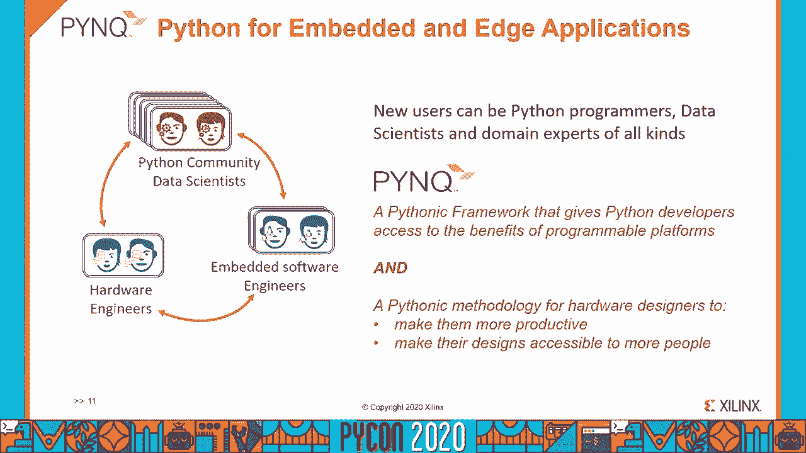

当设计粉红色时，我们向开源社区寻求灵感，例如，我们借鉴了 Python的一些重要思想和最佳实践，接下来我们会描述。

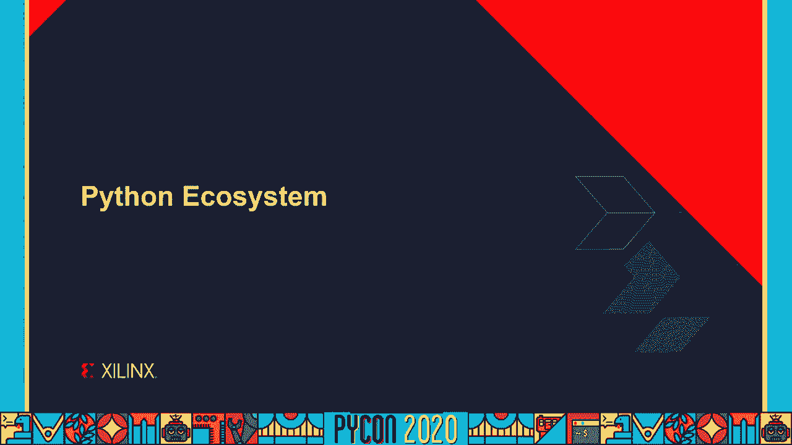

过去十年最大的趋势之一，在开源社区中，python语言越来越受欢迎，但它在学术界的广泛使用，第二个趋势是将 python用于嵌入式或边缘系统，现在，随着越来越多的嵌入式系统连接到云，在互联网时代的领域。

我们把这些系统称为边缘系统，还有这个，呃，表，它是18年7月由的黎波里制作的，电子电气工程师学会，这是他们第一次注意到，蟒蛇被列为嵌入语言，嵌入式语言通常是 c和 c，另外。

这些语言几十年来一直主导着嵌入式系统，所以，这是一个重要的承认，蟒蛇开始被用于嵌入式和边缘系统，它反映了覆盆子圆周率的影响，以及连接回云端的边缘系统所需的额外智能，使用蟒蛇有相当大的好处。

边缘和嵌入式系统，有数以百万计的蟒蛇开发者，据估计，目前全球活跃的 python开发者多达800万，嗯，你能做的目标发展，这个，正如我们之前提到的，意味着您不必进行交叉编译和交叉调试。

就像c和c++一样，这让设计感觉更简单，更有生产力，结果是更快的迭代周期，蟒蛇有一个巨大的生态系统和一个非常活跃的社区，嗯，Python使用c和c++非常有效地中断，为了成为，呃。

在嵌入式系统中与它们共存，它给了我们一个敏捷的软硬件协同设计流程的好处，最后，有很多可移植的代码可以在桌面之间重用，嵌入边缘系统，这是因为 python在虚拟机上执行，这就是蟒蛇群落的力量。

以及一个第三方生态系统，一个 python核心开发者说过一句名言 我是为语言而来，但我留下来是为了社区，这些类别中的每一个都有大约40%或更多的复合年增长率，所以，除了 python附带的标准库，皮皮。

所以，你真的可以说，普通的蟒蛇开发者站在一个大社区的肩膀上，一个巨大的蟒蛇群落就像艾萨克·牛顿说的那样，我看得更远 因为我站在巨人的肩膀上，它们实际上不是用蟒蛇写的，其中许多是用其他语言写的，例如 c。

C，加加加，爪哇与财富，这是非常值得注意的，蟒蛇的主要优点之一是，它与其他语言编写的代码接口的效果和频率，这并不完全令人惊 讶，既然我们说的是巨蟒，最受欢迎的蟒蛇版本，哪一个，当然是用 c写的。

但这仍然是一个重要的优势，我们看到蟒蛇与其他语言一起使用的例子，通常 python和调用用其他语言编写的代码有两个原因，第一种是重用其他代码，只需将其封装在python中，API。

第二个是加快 python代码的速度，其性能通常需要通过使用预编译 c代码来改进，例如，Scipi，实际上是写在，Python，当程序之间共享数据时，尤其是出于性能原因，重要的是避免不必要的，复制。

Python依赖于它的缓冲区协议，和 Numpy和数组有效地交换数据，这些都是我们在设计粉红色框架时借鉴和重复使用的想法。

过去十年最激动人心的蟒蛇项目之一，是木星计划，正如你将在下一张幻灯片中看到的，粉红色的建筑广泛使用木星。

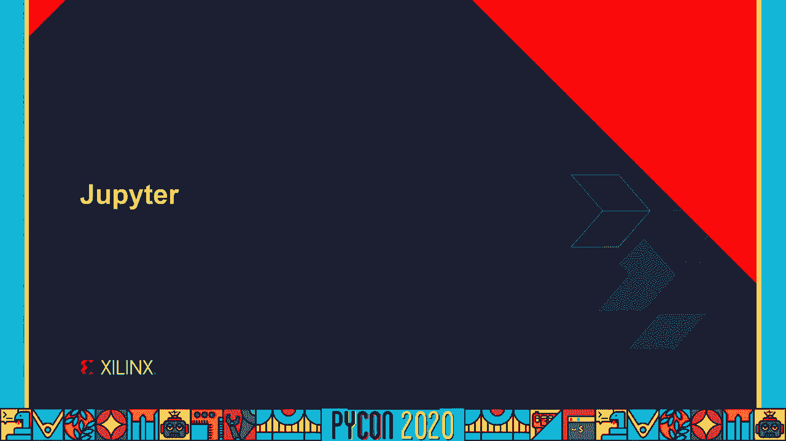

IPython是交互式 python的简称，是一个项目，一开始是为了创造一个更好的repl，更好的阅读，评估 python的打印循环，然而。

在浏览器界面的影响下 比如 mathematica和 sage mathematics，IPython演变成 IPython，笔记本和笔记本是网络文档，以及所有其他由现代浏览器支持的富媒体。

设计背后的一个关键动机，是为了解决科学论文缺乏可重复性的问题，通过提供一种新的可执行文件，因此是可复制的，文件，我发现笔记本被证明是一个巨大的成功，并被许多人收养，许多其他编程语言。

因此它的名字从 IPython改为了 jupiter，是茱莉亚的收缩，Python，和 r，三种编程语言，和人工智能，据估计，目前Github上大约有700万本笔记本，随着使用量呈指数级增长。

这项技术每年被教授给成千上万的大学生，也就是说，许多开发者真的很喜欢木星笔记本，但他们也想要更多的工具，他们在常规的综合开发环境中所熟悉的，他们的计划，这促使木星实验室的建立。

Jupiter Lab是基于 IDE的下一代浏览器，它是由学术界和工业界合作开发的，jupyter实验室成功的关键之一是开放源代码库，可调整大小的子窗口或窗格，所以如果我们看左手边的图表，代码编辑器。

外壳终端，木星实验室从地面上设计成可扩展的，每个窗口只是一个插件的实例，所以现在开发人员可以在使用更熟悉的身份工具的同时使用笔记本，使整体价值主张更有说服力，木星真正的天才在于它的系统架构。

它由客户服务器和语言内核组成，如图所示，块之间的接口定义良好，并基于开放标准，因为它使用了一个浏览器界面，它不需要支持很多不同的窗口系统，相反，通过使用浏览器，它受益于可能是世界上最开放的地方。

先进和广泛使用的计算机接口，例如，今天支持多达100种语言，木星计划被授予217年计算机机械协会软件系统奖，有点像软件系统的诺贝尔奖，TCPIP，Java和 Eclipse，所以这是一家非常好的公司。

这促使我们问，如果我们能在可编程的平台上运行木星会怎么样，使它成为粉红色框架建筑中不可或缺的一部分，消费者和专业产品多年来一直使用内部网络服务器，主要用于托管嵌入式配置门户，网络路由器。

激光打印机就是很好的例子，可以通过这些内部网络服务器进行配置，相比之下，Jupyter实验室通常运行在桌面或服务器类机器上，这里的想法是托管网络。

直接在可编程平台上的木星实验室 ide的服务器和语言内核，然后我们可以在目标上开发从任何网络到计算机的浏览器，这里显示的板子是粉红色的 z 2，尤其是粉红计划，粉红色的 z 2具有锌可编程平台。

它是木星的主行星，当然，如你所见，我们为粉红色的框架设计了一个粉红色的木板，为了让它更多一点，欢迎，和，乐趣，这张幻灯片显示了在锌可编程平台上运行的粉红色系统架构，我们运行木星实验室。

以及嵌入 ARM处理器的 Linux下的 IPython内核，然后我们在可编程逻辑上创建覆盖电路，覆盖层本质上是 fpga上高度可参数化的设计，在概念上与软件库相似，接下来，我们为覆盖创建c驱动程序。

并将它们封装在python中，API，以同样的方式，就像任何其他人一样，注意，所有浏览器都托管在通过网络连接的外部机器上，这种分区还具有卸载任何图形的优点，渲染到更强大的网络计算机。

该体系结构允许直接对目标进行软件开发，多亏了粉红色的框架，而且不需要在客户端机器上安装特殊的软件，一个现代的浏览器是所有需要的，现在是时候看看粉红色的行动了，为了这次展示。

我们有一个粉红色的 z板与一个通过网络连接的锌可编程平台，给一个客户，带有浏览器界面，在本片中，我们首先通过网络从浏览器访问 pink z two board，董事会的回应是启动木星实验室页面。

这和我们看到的着陆页完全一样，如果我们在桌面上运行木星实验室，我们要在文件浏览器中选择一个文件夹，我们可以在笔记本上滚动并检查它的输出，就像我们接下来在台式机上一样。

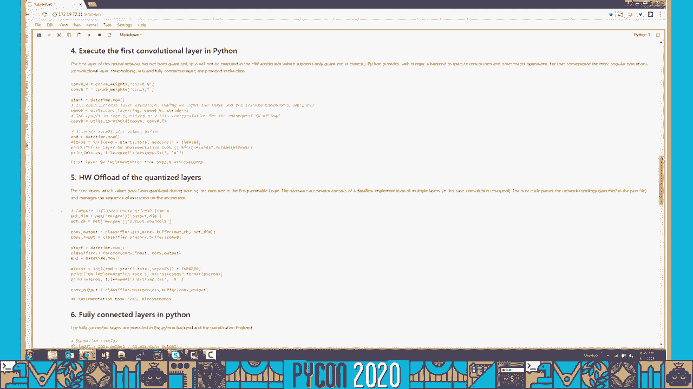

我们打开 linux shell和 cpu信息，为了证实我们确实是靠一只胳膊在跑，阴同步装置中的嵌入式微处理器，然后，我们可以执行一个树命令，去检查目标系统上的一些文件。

离开终端外壳，我们可以去 matplotlib的在线帮助，找到一个雷达图，我们现在可以将示例 notebook和 python脚本下载到外部主机，在这种情况下 是一台电脑。

我们可以确认我们拿到了新的笔记本和剧本，我们可以简单地将下载的文件拖放到粉红色的可编程平台上，在目标上重新打开它们，为了验证我们有笔记本和脚本版本的雷达图库，终于。

我们可以在目标上重新执行 python代码，无需写一行额外的代码，如你所见，木星实验室的 ide在锌可编程平台上工作得非常好，以及已经知道木星实验室的蟒蛇开发者。

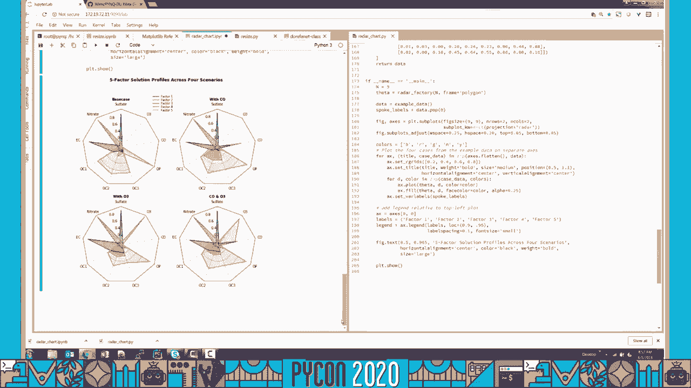

可以立即开始研究锌，接下来让我们更详细地看看粉红色的框架。

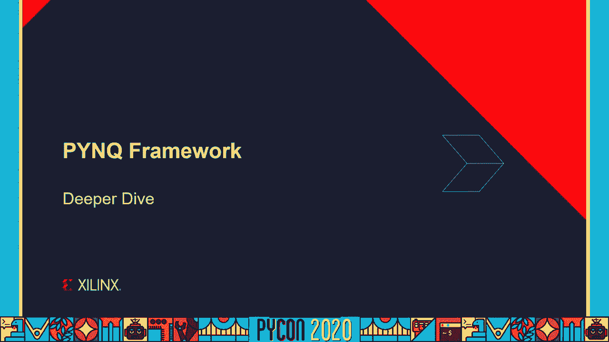

github是一个优秀的 jupyter笔记本存储库，因为它会显示渲染过的笔记本，很有帮助，把它作为我们粉红色框架的一部分，所以在最左边，旁边是一个在硬件中实现的电机控制示例。

这是派克克拉克马达控制算法，为了训练和推断，最后一个例子是一个开放的 cv过滤器，也在硬件中实现，稍后我们将更仔细地观察图像调整器，我们只需一个 pip install命令就可以做到这一点。

这会破坏设计，我们的目标开发板上的硬件和软件元素，在这张幻灯片中，我们会看得更详细，当我们开始使用我们刚从，Github，我们从运行在 ARM微处理器上的木星实验室开始，我们在之前的演示中看到。

注意在这一点上，可编程逻辑未配置，所以我们从打开笔记本开始，嗯，然后我们继续创建一个覆盖类的实例，参数化的调整大小，或位流，我们要加载到可编程逻辑中，一旦完成，我们现在有了 FPGA的硬件设计，当然。

我们可以运行笔记本，让它控制软件和硬件，有很多，当然，更多细节，但这些是主要的概念，蟒蛇开发者或数据科学家需要知道的，在这张幻灯片中，我们展示了图像调整器笔记本的两个部分，在左手边。

笔记本上显示图像大小的部分纯粹是用软件完成的，而在右手边，调整两个部分的大小 显示初始图像和调整大小后的图像，软件唯一的电阻使用众所周知的蟒蛇图片库药丸，在右手边，我们可以看到可编程平台设计的框图。

硬件主要由一个图像调整块组成，一些缓冲器和一个 dma单元，直接内存访问单元，有效地在dram和可编程逻辑之间移动数据。

在我们的第二次演示中，我们将显示图像大小正在执行，首先作为一个纯粹的蟒蛇程序，把结果对比了一下。

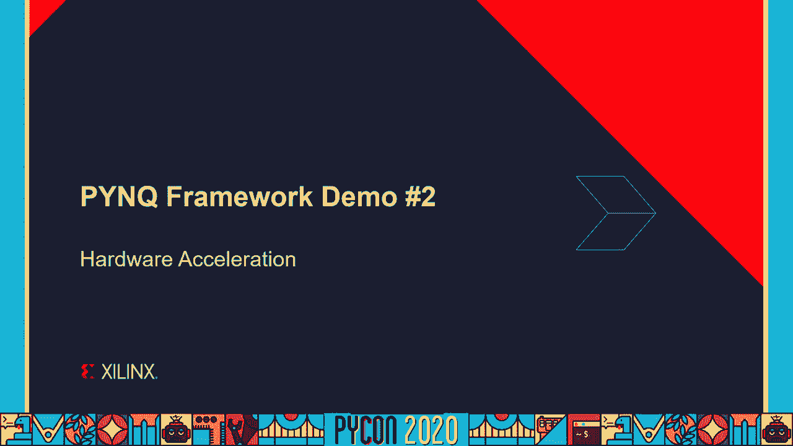

在本片中，我们会下载，安装，然后运行图像调整器，我们首先检查设计是否已经下载。

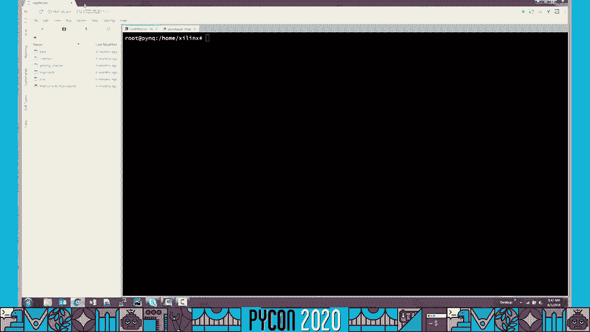

然后我们打开一个新的浏览器窗口，转到pink dl github repo。

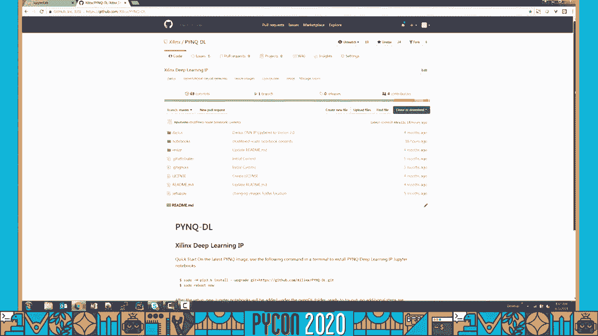

在这里我们得到了 pip安装命令，注意，我们使用的硬件配置与第一个演示中使用的完全相同，为了节省时间，我们缩短了下载时间，我们打开文件夹 取出朱庇特笔记本。

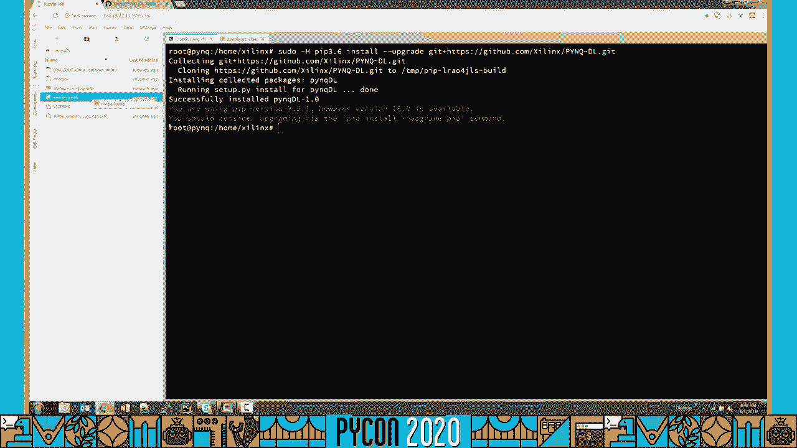

我们之前讨论过，尽管更详细，这种级别的细节完全是可选的，在这里我们可以看到笔记本细胞是不相关的，所以我们运行所有的细胞，一旦我们这样做了，我们看到活动状态指示器忙，指示处理。

现在我们可以看到调整大小的结果，首先我们看到软件调整大小，然后我们看到大小和硬件，你可以看到结果是相同的，在这种情况下，我们可以利用时间，它用来测量它在硬件中花费的时间，这大约是四毫秒。

对于这个相对琐碎的例子来说，相对于其较软的等价物来说，它的速度大约提高了三到四倍，在我们看下一步之前，让我们缩小一会儿 来总结一下粉红色能带来什么，Pink是一个开源框架，由软件和硬件组件组成。

以蟒蛇为基础，朱皮特，实验室麻木，以及许多其他的 python库，它可以在一系列不同的板子上运行，但我们应该注意到，粉红色本身并不是一块木板，它是开源框架。

管理兼具硬件和软件元素的设计的 python方法，Pink还鼓励更敏捷的开发，通过消除不同专业知识的开发人员之间协作的不必要障碍，它允许数据科学家与硬件和嵌入式软件工程师直接交流。

在同一个平台上与他们互动，粉红色还延伸了蟒蛇生态系统，通过向更多的 python开发人员提供可编程平台的好处。

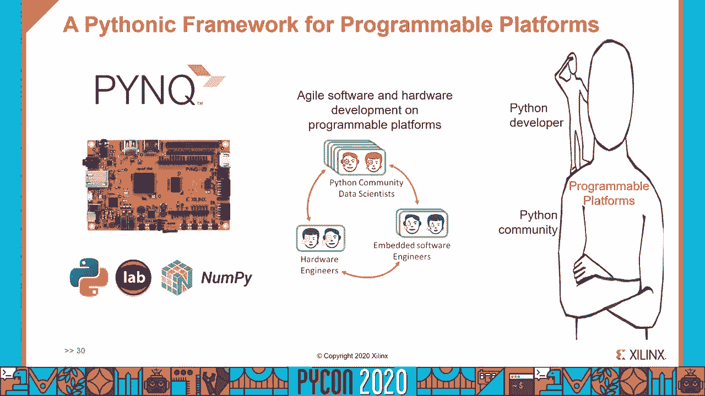

这是演讲的最后一部分，让我们看看下一步，特别是如何开始使用粉红色。

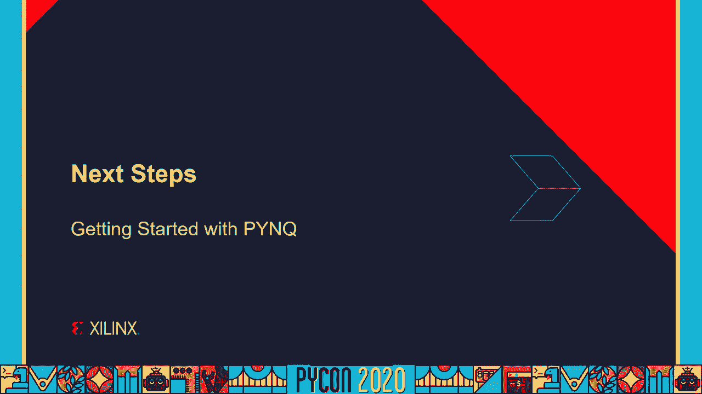

了解更多，我们建议你去品客，这是粉红色框架的主要位置，我们的 read doc站点上也有大量的文档，当然，所有的设计，硬件，和软件设计，我们在这次演讲中分享的是开源的。

可在我们的 Github存储库中使用，我们有一个活跃的社区页面，托管在话语上，在那里你可以提交问题，看看社区里的趋势是什么，获取受支持的董事会的完整列表，请看粉红色网站主登陆页面的部分，嗯。

而粉红色开始在锌设备上，它现在可以在一系列的板子上买到，其中一些使用不同类型的可编程平台，并不是所有的支撑板都是粉红色的，在这张幻灯片上，我们在社区网页上展示了一张快照。

它以来自世界各地的一系列令人兴奋和新颖的项目为特色，我们鼓励你去看看，有一件事我们没有谈过，到目前为止是如何设计 fpga电路，这是一个有意识的决定，因为这次演讲的重点不是逻辑设计，有一件事要注意。

然而，那是呃，在粉红色中，我们不是用蟒蛇合成电路，我们展示给你的所有 fpga设计都是用 xavivado工具创建的，如果你想了解更多关于设计可编程平台的知识，FPG是这样的，亚历克斯。

X使这些 vivado设计工具可用，镀锌板上的镀锌板是免费的，这里的链接可以让你下载软件，也有很多很多好的资源在那里，它可以帮助你理解你需要做什么 才能成为一个成功的逻辑设计师。

这里有一些非常有用的粉红色资源的链接，粉红色的主页，阅读，文档页面，Github站点，你还可以去哪里买一个粉红色的两板，总结一下，我们已经看到蟒蛇的流行，和嵌入边缘系统持续增加。

我们已经展示了锌可编程平台如何实现微处理器的所有好处，微控制器，FBGs，在芯片设备上的单个系统中 更多的方面，我们分享了开源 pink框架如何让 python开发人员可以访问可编程平台。

有最少的硬件经验，我们还看到了粉红色是如何让硬件设计师更有效率的，使它们能够与更大的蟒蛇群体分享它们的设计，最后，粉红色是每个人的，我们邀请你去探索它，我们期待着你将来成为粉红社区的贡献者。

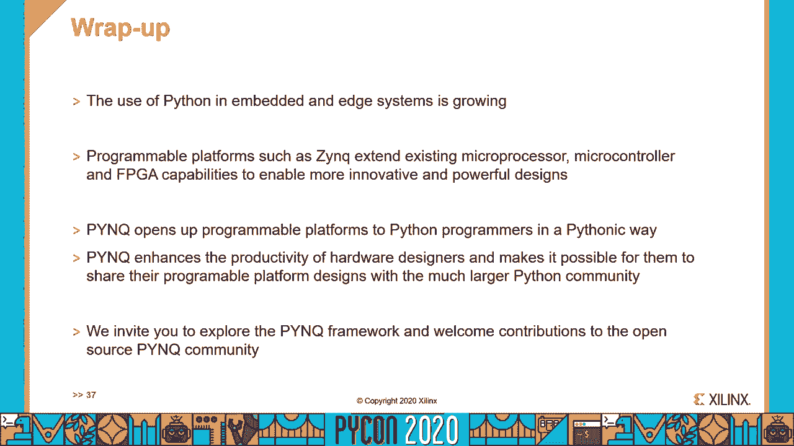

感谢您今天与我们分享您的时间，我希望你觉得粉红色框架的讨论很有趣，对你很有价值，我代表达令斯的所有同事，希望你和亲人平安健康快乐。

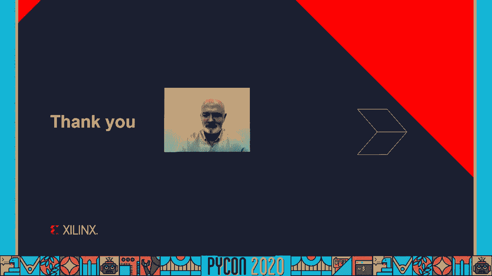

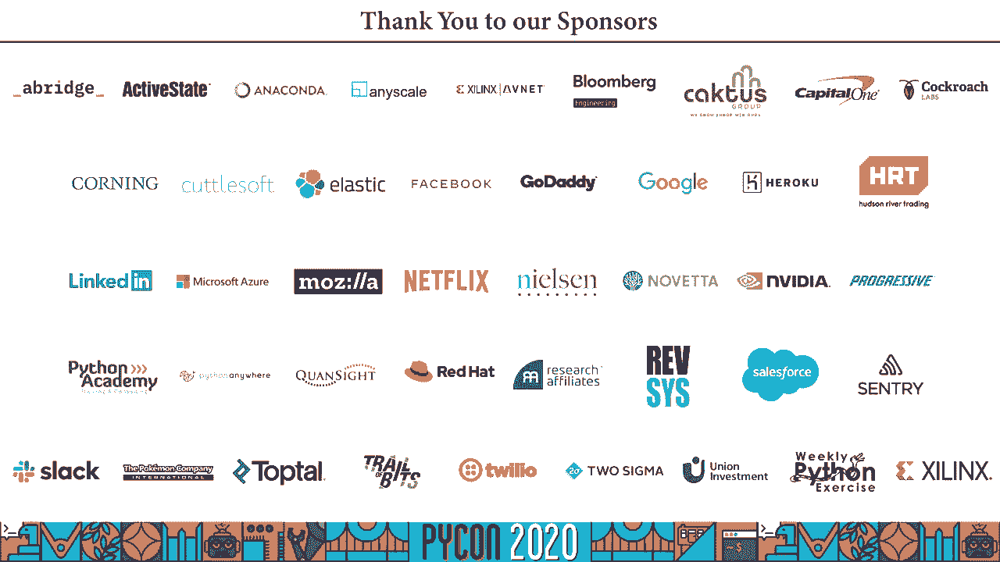