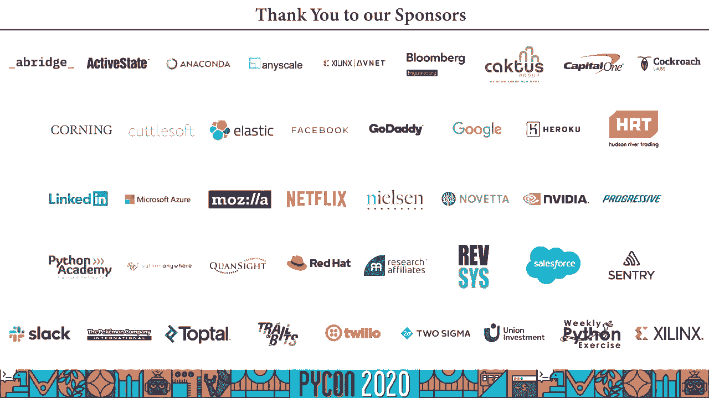

# PyCon US 2020 - P24：Talk Calvin Hendryx-Parker - Finite State Machine (FSM) in Django - 程序员百科书 - BV1rW4y1v7YG

大家好，欢迎来到派克二十楼，网络版，我今天在这里讨论的是 django有限状态机，所以我们开始吧，我叫卡尔文•亨德里克斯•帕克，但我也参与蟒蛇社区已经有一段时间了，我也参与了克隆社区。

它是一个开源的 python内容管理系统，我将从中汲取很多知识，讨论工作流和有限状态机，是基于我过去对梅子做的很多工作，因为它内置了一个非常强大的工作流系统，除此之外，这是我很棒的孩子和我的妻子。

我想感谢他们所做的一切，我想感谢蟒蛇的组织者，甚至把网络版，我知道这是一个很大的，一大障碍，有了现在的条件，但我想每个人都在凑合，我真的很兴奋来到这里，这是我连续第16条蟒蛇，如果我现在算上网络版。

我很高兴能成为，这是我第一次这么说，我们六英尺高的公司正在招聘，所以如果你在网络版发布的时候看到这个，请随时联系我或查看我们的网站，我们在找一些开发人员和项目经理，一些人加入我们令人敬畏的团队。

所以让我们开始深入到 django的有限状态机中，那么什么是工作流呢？所以工作流程，如果你想想它们是一系列的互动，完成某种任务，他们在你的现实生活中无处不在，如果你想一想你周围发生的任何商业规则或逻辑。

现在它们可以是正式的和非正式的，基本上这些都是状态的子集，当你要求带薪休假时，你提交了一份申请，该请求得到批准或拒绝，回到你身边 进入一个新的状态，批准或拒绝，因此。

我们已经非常熟悉现实生活中的工作流程，但我们需要熟悉如何模拟，或者在我们的应用程序中建模那些相同类型的工作流，这就是有限状态机发挥作用的地方，所以有限状态机或者说有限状态自动化就是一个简单的状态机。

以及用来设计计算机程序的行为模型，更具体地说，有限状态机是由与转换相关的有限数量的状态组成的，关键是过渡，当我们通过这次谈话时，我们会发现，过渡到，从一个州开始到另一个州结束的一系列行动。

或者是同一个州，或者是什么推动了整个过程，以及我们将要看到的所有工作流程，因为我们，当我们进入一些我们今天在这个演讲中看到的例子时，让我们以一个简单的例子开始，所以如果我们考虑最简单的有限状态机。

我的意思是你也许可以用一个州建立一个更简单的，但一般来说，你会有多个州，在这种情况下，我们看到的是一个发布模型，这是一个最简单的克隆发布模型，联系人管理系统。

它实际上内置了一个叫做直流工作流的工具 非常强大，超简单，我很惊讶，更多的软件没有模仿它的模型，我们如何在软件代码中建模有限状态机，但在这个例子中 我们会看到有一个私人国家，也就是物体的初始状态。

有一个公布的状态，这就是图中的两个圆圈，然后在它们之间你会有一个过渡，所以它们被贴上了标签，带箭头的线，发表或撤回，所以一些私下开始的东西可以被发布到发布状态，再缩回缩回状态，我们会看到更多这样的图表。

在我们今天的演讲中 帮助说明，你知道我们如何在自己的项目中使用有限状态机，唯一没有显示的是，在这个具体的例子中 我们没有看到谁被允许做什么，当你谈论软件时，这一点变得非常重要。

因为你想在一定的条件下设置警卫，只允许特定的人在特定的时间做特定的事情，另一件事是我们通常会在，例如，Django，我们可能只是想用布尔运算，就像真的或假的，就像我们模特身上的旗帜，说某样东西是否出版。

在某些情况下是有效的，但总的来说，您的代码或应用程序将达到一个复杂的水平，仅仅有两个州是不足以建立模型的，你的应用程序中发生的事情的现实，所以什么时候是工作流状态，真正的布尔主义者，不是真的。

我想你会发现在大多数情况下，应用程序中的工作流状态实际上会有多个状态，所以一般来说，一个布尔标记，比如已出版的或未出版的，并不能很好地应用于大多数类型的应用程序，因为你需要处理一些事情。

可能你的数据库里有行，正在被一些外部程序处理，很容易就会选择，你知道吗，使它成为一个布尔标记，你知道就像加工过的，但你可能有比赛条件，因此，您可能希望为这个第三方进程选择数据库中的所有项目，寻找那些。

你知道吗，未经处理，把它们放入处理前的处理状态，然后把它们放入加工状态，这样你就可以追踪，因为它们目前正在被其他外部系统处理，在你的，也许你无法控制，或者只是一般情况下 你现在可以控制。

谁可以访问或锁定应用程序中的特定对象，所以如果我们把这个扩展到合作，再看看用户只希望与特定用户共享信息的事实，我们希望能够拥有与权限相关的工作流状态，他们自己也是，例如，您可能只希望对象的当前所有者。

创建对象以访问编辑对象的人，但当它进入出版状态时，你可能想让匿名用户访问网站，才能真正看到这些物体，可能您实际上并不希望对象的所有者编辑，当前的内容，如果是公开的，因为你想让他们收回。

也许通过审查工作流程将其发送回来，有某种悬而未决或提交审查的状态，所以这就是我们可以用 django来模拟的东西，这在克隆中其实很容易做到，我们可以试着在节目中这样做。

一些我们如何在 Django内部做到这一点的例子，够了，谈论理论例子和玩具小项目，我们来谈谈真实生活中的点点滴滴，我想我们很多人都是大学的学生，如果你曾经换过专业，你就会知道这有多痛苦。

以及如何用面向纸张的过程来填充，所以如果你仔细观察这个过程，我们为当地社区大学做一个项目，这里的自动化和把它放在网上，更改或请求更改程序的过程，你看这里，这是一张图表 专门描述了。

所以它可能从特定的状态开始 就像在进行中，所以作为一个学生，我会提交我的请求来改变我的程序，该请求将提交，进入，就像一个悬而未决的审查，之后可能会有多个状态，例如，如果您从挂起的审查状态查看此图。

它可以去不完整的，然后可以返回到重新提交给，原学生补充信息，它可以被标记为完整的，所以他们的意思是院长接受，然后它通过剩下的工作流状态，或待审查，它可以直接进入拒绝状态，这意味着没有足够的信息。

并不是说没有足够的信息表明请求实际上已经被拒绝了，现在我们追踪模型中的一个变量，我们的国家，我们要求更新程序，所以你可以看到这些，这些可能很复杂，他们可以经历很多，许多不同的州。

它们最终会出现在许多不同的地方，所以图中所有的圆圈都是工作流状态，所有的箭，所有的线条都是特别的过渡，我们不仅可以将其应用于业务流程，比如改变你的大学课程，但如果你在研究癌症。

你想在你的网站上接受案件报告，提交供发表，让他们通过审查程序，让他们通过作者审查程序，我也有一个很好的例子，你看这里，物体的初始状态在左上角，保存转换的正确滚动，这张图的有趣之处在于。

你会注意到有过渡箭头返回到相同的状态，基本上我们现在可以用它来跟踪并记录到数据库中，当一个项目被保存，所以保存操作或转换，只把它带回到原来的工作流状态，主要是为了追踪它是什么时候被保存的。

以及它被保存的频率，或者当修改真的发生在项目本身上，这可能会在我们的系统内部引发其他类型的行为，好让你重见光明，大圆圈是我们的状态，箭头是我们的过渡，案例报告可以从被创建者多次保存的草稿状态开始。

这里的颜色表示谁有权编辑项目，所以现在我们开始讨论谁能做什么，当这样的时候，模型或对象对象的所有者实际上可以编辑，单击，在那个时间点编辑，并在提交时立即保存，而在处理状态下 你会注意到一个是红色的。

在这种情况下，只有审核者才能编辑和重新发送特定的对象，我们现在知道它已经通过了处理状态，进入一个单独的状态，称为作者审查，被重新提交回编辑器进行处理，然后要么出版进入直播状态，你注意到在直播状态下。

我们就像在一个灰色的圆圈里，这意味着审查者和对象的所有者，实际上可以编辑它并保存它，但我们确实有两种不同的过渡或两种不同的颜色，这里有一个红色的过渡，审阅者可以执行它来修改对象，所以由管理员收回或蓝州。

物体的主人说，我想修改一下，我要把它拉回到作者评论状态，当主人不能直接重新发布回来 生活，而不需要经过处理步骤 并在整个过程中对他们的对象进行全面的审查，所以你可以看到，我们又有很多事情要做。

这个问题的关键是谁能在何时何地做什么，事实上，转换实际上可以导致回到相同的工作流状态，当水流停止时 物体，另一件需要考虑的事情是，一些工作流转换和工作流状态，运动可以是自动的，你知道吗。

可由触发器触发转换，通常，触发器是应用程序中的最终用户，点击编辑按钮，点击保存按钮，点击你知道提交审查按钮，但这可能是，例如自动，可能是一些外部的过程，如果你拿一个程序回顾的例子来说。

有人可能会提交一份申请 并与该申请一起提交文件，你可以让一个事件在系统之外运行，检查那些文件是否有病毒，也许你得到了一个批处理状态，它发出了一个过渡的触发信号，从隔离状态到清洁状态。

这样文件本身就有它自己的工作流集来处理它，但实际上并没有被最终用户看到，但这些转变和交易的结果是由用户看到的，所以你必须保持，你也可以考虑到你的转变可能会发生，你知道在人类的直接控制之外。

这是一个常用的用例，也许你有一个网站，你想批准会员，所以可能会有会员报名，他们填写，只需使用密码启动初始帐户，他们进入现场的下一步可能是要么证明他们的人类，或在个人资料中添加额外的所需信息。

也许审批过程并没有真正开始，直到表单被完全验证并完成，所以一个用户模型，也许在某种预先批准的状态下，经历一个自动过渡，说，准备批准，在这一点上，你可以过渡到审查状态，为了让评审员真正看到那个用户。

批准他们，或者只是拒绝他们作为你网站内的用户，所以有些触发器是自动的，也许在保存时，它评估是否可以进入下一个状态，或者不好，我们已经讨论了很多关于工作流和有限状态机的问题。

我知道这就是为什么你们大多数人来到这里看到这个话题，对于有截止日期的完美主义者来说，它是我们最喜欢的网络框架之一，我喜欢这句广告语，它固执己见，因此，对于进入django生态系统的新开发者来说。

有很多关于模板语言的决策需要您去做，使用的奥姆，但它不是很固执己见，当涉及到角色和权限领域时，我是说有些简单，为你准备的一些小事，比如员工和管理员之类的角色，但剩下的部分由开发人员决定。

它们通常是非正式的，分散在代码中，你在做什么，就像这里的小支票，小支票，你知道典型的姜戈人，你知道你建立你的模型，你暴露了管理员，您在某个点上创建一些视图，你想增加限制，您认识的用户希望查看对象。

你知道他们想看到已经发生的变化，如果没有某种框架，此代码用于保护项目，或者确定谁可以做什么可以分散在模型、视图和管理命令中，论坛和中间件，还有你，你知道吗，您最终基本上构建了自定义查询。

并将它们遍布整个代码，所以这会导致，你知道吗，非常不可维护，不受欢迎的意大利面代码，所以当我们回顾过去，如果我们有一个能帮助我们的框架就好了，尤其是这样一个框架，谁能做什么，当胜利有点棘手的时候，这里。

这就是我们进入的地方，我们如何防范，谁能做到，什么角色是真正的，我们稍后再看，其实有一点点奖金在这里，如果我们开始使用这个框架，我们可以很容易地开始记录，谁能做什么，什么时候做。

当他们做的时候实际上记录，有审计线索，挺好的，所以我们首先要做一些胖模特，这是我们开发生果的首选方 式，我认为詹戈实际上鼓励制作视野狭窄的胖模特，所以下面加上。

因为姜戈实际上是建立在创造胖模特的想法上的，有大量的字段和方法可在应用程序中使用，所以我说的是 django fsm，所以 fm代表有限状态机，这很好，因为它是一个可重用的框架。

这有助于让团队中的每个人在精神上保持一致，以如何前进，我们将控制应用程序中对象的状态，如果没有这个，你又知道了，代码团队变得非常分散，你知道一个人以一种方式进行国家管理，另一个人在第三个人做许可管理。

然后它变得很难维护，实际上人们在整个代码库中工作，所以从姜戈开始，它在吉瑟布上，所以如果你去吉瑟布看看，Django fsm，有一个网址就在那里，我喜欢什么，这是一个解决复杂问题的非常简单的方法。

有限状态机，如你所见，我展示的一些图表很难用，把这些图表提供给你是非常有帮助的，在类上创建这些状态和转换时，最好的部分是我以后会给你看的，实际上，您可以开始自动地从代码中创建这些图，我来教你怎么做。

所以 django fsm的基础是，会有一个自定义的模型字段，FSM领域，过渡的蟒蛇装饰器，然后是模型类的模型方法，通过对课堂的贡献，这实际上是一个很好的用法，在这里为课堂做出贡献。

但基本上当你创建一个领域 并开始装饰你的，该模型上的方法具有诸如编辑、发布或提交转换之类的功能，对课堂的贡献，我们将开始在您的模型中添加一些自动方法来收集信息，有哪些过渡可用，所有的转变是什么，哪些州。

我会在接下来的演讲中展示这些，所以让我们直接切入，让我们先看看 fsm域，因此，向现有模型中添加工作流状态非常简单，我喜欢这个工具，你只要在你的模型上加一个字段，您将看到这一行代码的最后一个字段。

以下是工作流状态，是一个 fsm字段，我们把它放在那里，这个将是基于文本的，因此，您可以为您的各种工作流状态存储一组字符串，还有一个 fsm整数域，如果你想储存，就像一个枚举的状态集，而不是字符串。

但我们基本上配置了，那么，哪些是可能的和可用的工作流状态，什么是默认，这将是你的初始状态，您的模型作为您的模型的一个新实例被创建，然后显然是一些帮助短信，所以你看，这些都是从工作流状态导入的。

通常我们会在我们的 django应用程序中创建一个模块，在里面我们会，我们将为我们的工作流状态设置一个类来存储所有这些，封装了所有关于我们工作流状态的信息。

存储到数据库中的各种工作流状态的字符串等价物是什么，然后我们把它设定为我们的选择，然后我们有一个初始状态，再次选择其中一个工作流状态作为初始状态，很好，很容易开始。

所以在这些工作流状态之间移动 总是在这些工作流状态之间移动，你可以设置转换，你知道吗，直接更改数据库数据，通过将其中一个字段改为另一个字符串，但你做这些事情可能会有意想不到的副作用或后果。

那么我们如何到达这些州，那就是创造我们的过渡，所以我们的过渡只是我们模型上的方法，有过渡装饰 你可以看到这是一个非常简单的，这实际上是编辑转换，它在之后保持在完全相同的状态，所以如果你看看这个转变。

我们看看这个转变会影响到什么领域，所以在我们的例子中，一个是工作流低估，我们看一下源态的源态，有相关的权限，这很好，因为你现在可以用一个可调用的人来保护谁 可以编辑谁可以 你知道什么。

无论谁能被允许称之为这种转变，最后你会看到目标，如果这个方法成功，你的实例会处于什么状态，在你完成这个方法之后，所以再次，确保你有你所有的，通过工作流状态转换，因为如果你开始修改这些东西，例如。

如果你进入 django管理 然后手动更改这个值，你将绕过在这个转变过程中应该发生的任何影响，你可能会呼叫系统的其他部分，或者呼叫第三方系统，我将展示一个如何工作的例子，也许你想在批准时发一封电子邮件。

这样店主就知道他们的东西被出版了，这里有所有其他可选部分，例如，您可以在这里传递的参数上有一个 on错误，把它设置成一个过渡状态，如果方法出错，例如，所以也许你有一个死信队列，或者其他某种状态。

在这种状态下，这个东西会处于错误状态，这是另一个可能更复杂的转变的例子，我们将从作者评审工作流状态开始，我们会允许提交，我们最终会进入管理审查状态，在这个过程中 我们会设置一些其他的变量。

实例上的其他值，例如，作者认可的是真的，但管理批准目前是假的，但更重要的是，我们实际上想把批准的电子邮件发给某人，并有那个触发器，作为整个过渡阶段的一部分，现在让我们看看权限，所以如果你看到这里。

许可是可以提交，在本例中，我们要确保只有作者才能调用这个经过批准的方法，如果系统中的其他人打电话给它，但没有，该内容的作者不是当前的用户，我们想破例，可以在应用程序中捕获和处理的工作流异常。

所以如果我们看一下，可以提交，我们要确保当前的用户，所以如果你看这里，如果不是用户调用中间件，当前用户中间件以获取当前用户，如果模型上的当前用户和主要作者匹配得很好，这返回为真。

转换可以继续进行 让用户移动它，到下一个工作流状态，你知道吗，条件只是调用列表，所以如果你回头看这里，我们有一个许可可以提交，但你实际上可以在那里有一个电话列表，确保他们都满意。

在他们被允许真正调用特定的工作流转换之前，这是另一个更复杂的，例如，我可以编辑，它实际上会做更多的逻辑，想弄明白，你是否知道这个人被允许再次编辑，让当前的用户看到，如果工作流状态处于非常特定的状态。

该用户与所有者匹配，我们就能回归真，或者如果工作流状态是一个管理审查，用户是工作人员，我们还希望允许他们调用 can edit或 edit transition，否则我们回假。

所以我们再次获得了很大的灵活性，当一个转换是实际可用的时候 把逻辑放进去，重要的是这不是，只是为了让后端代码来确定，不管有没有差错，我们实际上可以在前端使用它来确定，就像某些转变，或者某些转换是否可用。

所以我想起来了，我提到过，有一些方便的方法被添加到您的模型中，通过对课堂的贡献，这些就是那些便利，所以，例如，您可以说获取所有工作流状态转换，它将为您提供所有在模型中声明的转换，如果你想看当前的用户。

您可以说获取可用的用户工作流状态转换，所以你现在可以得到有限的上下文限制，你知道吗，用户可以使用的操作集，所以现在你可以用它把它构建到你的前端，并动态地确定实际上应该向用户显示哪些转换。

所以如果我们是管理员看到草稿，在提交审查之前，编辑按钮可能不会对我们可用，因此，现在您可以根据这些权限轻松获取转换，让工作流逻辑真正对你有利，很多信息，但我要去看看，我们要去其他一些很酷的地方。

Django fsm，除了给我们场和过渡位，而且这些方便的方法也有一些信号，对我们来说很方便，所以如果我们真的想，在转换发生之前 调用一些调用，或者在过渡发生后，以某种不那么耦合的方式进行。

我们实际上可以从姜戈那里得到这些事件，用于过渡前和过渡后，做我们的行动，我们会被派去参加模特班，当前实例是根据调用的转换的名称进行操作的，然后我们得到源模型状态和目标模型状态。

所以我们实际上可以在事件处理程序中设置一些逻辑，你知道吗，做一些动作，例如，我们来看看这里的信号，这是病例报告管理系统发出的信号，我们把过渡和案件报告联系起来，在这种情况下 我们要，对我们的。

我们现在的例子，你知道吗，抓出转型名称，源名称，etc，然后我们打印出来，你知道吗，例如，这里有一些日志信息，如果这个状态不等于源态，你知道吗，在这里做点什么，说到做某种行动。

如果你想知道到底是谁在编辑 或者是谁在你的网站里做了一些事情，在实施过程中，很难知道当前用户是什么，因为这可能是从管理命令中调用的，或某种外部服务或外部来源，因此，可能并不总是清楚当前用户是谁。

如果你想来这里比较当前的用户，在系统中的模型上表示作者字段，您需要使用自定义中间件，我们过去通常做的事，是实现某种中间件来让用户，从当前请求中自定义当前用户，现在，那个，所以，如果你真的想去，你知道吗。

获取当前用户中间件，我建议安装 django cr cru m，在你的转变和事件中使用它，所以你可以让当前的用户，并将其与当前用户的当前集合进行比较，他可能是这个系统的作者，或者别的什么。

稍后我们还将讨论在哪里使用 当前用户是很重要的，当我们谈到进行审计跟踪时，好吧，呃，最后一点，所以如果我们再让当前的用户，使用那个中间件，我们要把它送回去，找到现在的用户 给他们发邮件，因此。

能够查找特定的用户，并向用户发送一个操作，例如，有一个送回的过渡发生了，我们会使用这个中间件来让用户，所以我们可以发送适当的电子邮件，所以这是对的人说的，当前登录的用户。

可能看起来像是在给邮件的作者发送邮件，另一件要记住的重要事情是，如果你有潜在的比赛条件，如果两个用户单击相同的事务转换，或者在系统中的同一个对象上进行不同的转换，同时，有可能在特定的比赛条件下，混合。

如果你让你的模特继承了，只要您总是运行保存方法来保存对象，在你的观点里 或者在你的模型里，那么它应该会给你一些保证的保护，免受这些比赛条件的影响，你肯定想确保你在这里做最后一点。

如果你想要方便又美观的审计日志，有能力，有一个额外的，内置另一个 decorator的 um过渡日志支持，所以你会看到在这个特定的过渡上 有两个装饰师，正常的过渡装饰，但也有 fsm的记录。

所以只要加上一个装饰师，把这个添加到 django上，FSM日志将在数据库中提供一个表，对该对象发生的所有事情都有完整的审计记录，每一个转变都被称为，谁叫它 当他们叫它，然后你可以做额外的，你知道吗。

审计和报告，在此基础上，你想再次提到，确保在转换之外没有编辑 fsm字段，所以如果你想把 fsm添加到 django管理中，因为有些人真的喜欢，能够享受到 django管理的便利。

有一个 django fsm管理，再加上姜戈，这可以强制 fsm字段，只能通过过渡来操纵，很方便的，所以，如果你真的进入你的管理，并添加各种，您知道您添加的 fsm字段的部分内容。

您现在可以确保这些都是暴露的，可以像按钮一样编辑，而不是像字段一样 当你点击，编辑您当前的模型，您还可以强制要求管理员只能通过转换进行这些更改，而不是直接编辑字段和指定您自己的值。

这是非常方便的 再次确保你的模型保持一致，因为在这些转换中可能会有外部服务发生，那就要看你最后的申请了，但并非最不重要的是，我们在 django fsm中内置了一个很棒的工具，使我们有能力给出这些图表。

那些带有点、线和过渡的漂亮图表，这实际上是一个内置到 fm中的管理命令，所以如果你走进去，管理指挥当前模式，它会输出一个点文件，我不知道你用过多少图，但是呃，现在你可以用一些参数来处理这个文件。

拍张漂亮的照片，实际上发生了什么，只有当你有图的时候才是模型，我们的图是安装到虚拟环境中的模块，因此，请确保您在开发环境中安装了虚拟依赖关系图，我的意思是在你的生产环境中 通常不需要这个。

除非你要展示这些图表，但在你的开发需求中 找出你要做什么，确保将图作为依赖项，一旦你做到了，你会得到一个漂亮的形象，这是直接从代码生成的案例报告工作流用例，很方便的，因为现在你的部分测试，你可以回去说。

这个过程的企业主，给他们一个图像，从技术上讲，他们可能不是这样的，你可以读取 python代码，但他们当然可以看着这张照片说是的，这是有道理的，我一直在开发的业务流程。

基本上你可以看到你在代码中输入了什么，现在当你更新你的代码，您可以不断地生成这些图，并与业务单元进行验证，如果有人有任何问题，请随时在网上与我联系，我是6英尺高的卡尔文。

你也可以在 calvin hp的 twitter上找到我，我很乐意讨论任何事情，Django，有限状态机，工作流程，内容管理，所有这些事情，而且我绝对很容易找到，所以请再联系我，我想发出一个巨大的。

谢谢，感谢蟒蛇二十的组织者举办这个虚拟的在线活动，我很兴奋，我要参加，这是我第一次和蟒蛇说话，我想每个人都在做最好的，他们可以一次又一次地了解一个情况，感谢大家收看视频。

